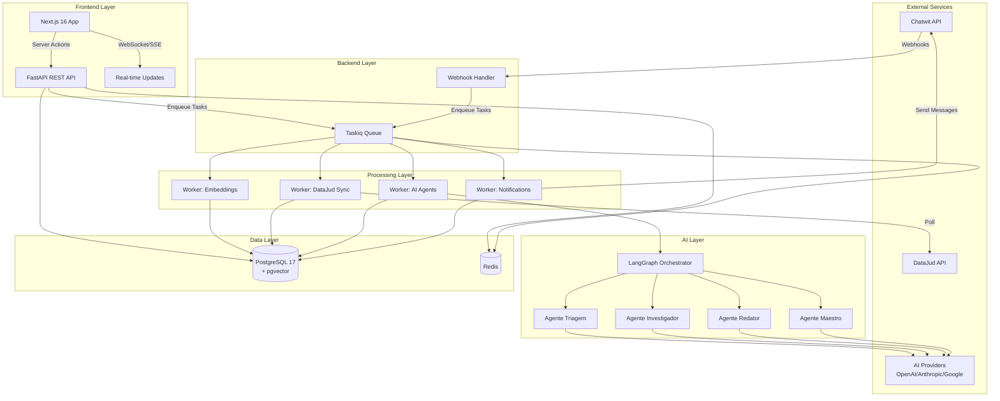
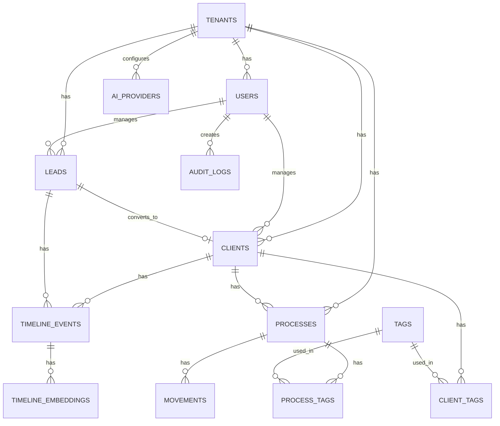
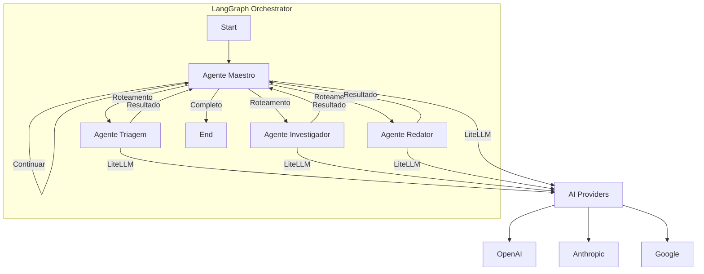

# Design Técnico: JusMonitorIA CRM Orquestrador

## Overview

O JusMonitorIA é uma plataforma multi-tenant de gestão jurídica que integra CRM, monitoramento processual automatizado e inteligência artificial para aaescritórios de advocacia. O sistema orquestra a comunicação entre clientes (via Chatwit), monitoramento de processos (DataJud) e agentes de IA especializados para automatizar triagem, investigação e redação de documentos jurídicos.

### Objetivos Principais

- **Multi-tenancy**: Isolamento completo de dados entre escritórios de advocacia
- **Automação Inteligente**: Reduzir trabalho manual através de 4 agentes IA especializados
- **Integração Omnichannel**: Centralizar comunicação via Chatwit (WhatsApp, Instagram, etc.)
- **Monitoramento Proativo**: Acompanhamento automático de processos via DataJud
- **Gestão Unificada**: CRM com funil inteligente e prontuário 360º do cliente

### Stack Tecnológica

- **Frontend**: Next.js 16 (App Router), React Server Components, Shadcn/UI
- **Backend**: FastAPI (Python 3.12+), SQLAlchemy 2.0 (async), Pydantic v2
- **Database**: PostgreSQL 17 + pgvector extension
- **Cache/Queue**: Redis 7+
- **Task Queue**: Taskiq (async task processing)
- **IA**: LangGraph, LiteLLM (multi-provider), OpenAI/Anthropic/Google
- **Containerização**: Docker + Docker Compose
- **Observabilidade**: Structured logging, Prometheus-ready metrics


## Architecture

### High-Level Architecture



### Component Responsibilities

**Frontend (Next.js 16)**
- Server Components para renderização otimizada
- Client Components para interatividade
- Server Actions para mutations
- Real-time updates via WebSocket/SSE
- Autenticação JWT com tenant_id

**Backend API (FastAPI)**
- REST endpoints com validação Pydantic
- Middleware de tenant isolation
- Dependency injection para repositories
- Rate limiting e throttling
- Health checks e métricas

**Webhook Handler**
- Recebe eventos do Chatwit
- Valida assinaturas
- Enfileira tarefas assíncronas
- Responde rapidamente (< 5s)

**Taskiq Workers**
- Processamento assíncrono de tarefas
- Retry com backoff exponencial
- Dead letter queue para falhas
- Distribuição de carga

**AI Orchestrator (LangGraph)**
- Coordena fluxo entre agentes
- Gerencia estado da conversa
- Roteamento dinâmico de providers
- Fallback automático

**Database (PostgreSQL + pgvector)**
- Multi-tenancy via tenant_id
- Embeddings para busca semântica
- Índices otimizados
- Row-level security (opcional)

**Cache (Redis)**
- Session storage
- Task queue backend
- Rate limiting counters
- Real-time pub/sub


### Multi-Tenancy Strategy

**Application-Level Isolation**
- Tenant ID em todas as queries via middleware
- JWT payload contém tenant_id
- Repository pattern força filtro automático
- Validação em múltiplas camadas

```python
# Middleware automático
class TenantMiddleware:
    async def __call__(self, request: Request, call_next):
        tenant_id = extract_tenant_from_jwt(request)
        request.state.tenant_id = tenant_id
        return await call_next(request)

# Repository base
class BaseRepository:
    def __init__(self, session: AsyncSession, tenant_id: UUID):
        self.session = session
        self.tenant_id = tenant_id
    
    def _apply_tenant_filter(self, query):
        return query.where(Model.tenant_id == self.tenant_id)
```

**Database Design**
- Todas as tabelas têm coluna `tenant_id UUID NOT NULL`
- Índices compostos: `(tenant_id, id)` para performance
- Foreign keys respeitam tenant_id
- Opcional: PostgreSQL Row-Level Security para camada extra

**Network Isolation**
- Docker networks isoladas por ambiente
- Containers não expostos diretamente
- API Gateway como único ponto de entrada


## Components and Interfaces

### Backend Structure (Clean Architecture)

```
backend/
├── app/
│   ├── api/                    # API Layer
│   │   ├── v1/
│   │   │   ├── endpoints/
│   │   │   │   ├── auth.py
│   │   │   │   ├── clients.py
│   │   │   │   ├── processes.py
│   │   │   │   ├── leads.py
│   │   │   │   ├── timeline.py
│   │   │   │   └── webhooks.py
│   │   │   ├── dependencies.py
│   │   │   └── router.py
│   │   └── middleware/
│   │       ├── tenant.py
│   │       ├── auth.py
│   │       └── rate_limit.py
│   │
│   ├── core/                   # Business Logic
│   │   ├── domain/
│   │   │   ├── entities/
│   │   │   │   ├── client.py
│   │   │   │   ├── process.py
│   │   │   │   ├── lead.py
│   │   │   │   └── timeline_event.py
│   │   │   └── value_objects/
│   │   │       ├── cpf.py
│   │   │       ├── cnj_number.py
│   │   │       └── phone.py
│   │   ├── use_cases/
│   │   │   ├── create_client.py
│   │   │   ├── sync_process.py
│   │   │   ├── generate_briefing.py
│   │   │   └── convert_lead.py
│   │   └── services/
│   │       ├── chatwit_service.py
│   │       ├── datajud_service.py
│   │       ├── ai_service.py
│   │       └── embedding_service.py
│   │
│   ├── db/                     # Data Layer
│   │   ├── models/
│   │   │   ├── base.py
│   │   │   ├── tenant.py
│   │   │   ├── user.py
│   │   │   ├── client.py
│   │   │   ├── process.py
│   │   │   ├── movement.py
│   │   │   ├── lead.py
│   │   │   ├── tag.py
│   │   │   ├── timeline_event.py
│   │   │   ├── ai_provider.py
│   │   │   └── audit_log.py
│   │   ├── repositories/
│   │   │   ├── base.py
│   │   │   ├── client_repository.py
│   │   │   ├── process_repository.py
│   │   │   ├── lead_repository.py
│   │   │   └── timeline_repository.py
│   │   └── session.py
│   │
│   ├── workers/                # Taskiq Workers
│   │   ├── broker.py
│   │   ├── embeddings_worker.py
│   │   ├── datajud_worker.py
│   │   ├── ai_worker.py
│   │   └── notification_worker.py
│   │
│   ├── ai/                     # AI Layer
│   │   ├── agents/
│   │   │   ├── base_agent.py
│   │   │   ├── triagem_agent.py
│   │   │   ├── investigador_agent.py
│   │   │   ├── redator_agent.py
│   │   │   └── maestro_agent.py
│   │   ├── graphs/
│   │   │   ├── briefing_graph.py
│   │   │   └── lead_qualification_graph.py
│   │   ├── prompts/
│   │   │   └── templates.py
│   │   └── providers/
│   │       └── router.py
│   │
│   ├── schemas/                # Pydantic Schemas
│   │   ├── client.py
│   │   ├── process.py
│   │   ├── lead.py
│   │   ├── webhook.py
│   │   └── ai.py
│   │
│   └── config.py               # Configuration
│
├── tests/
│   ├── unit/
│   ├── integration/
│   └── property/
│
├── alembic/                    # Database Migrations
│   └── versions/
│
├── docker-compose.yml
├── Dockerfile
└── pyproject.toml
```

### Frontend Structure (Next.js 16)

```
frontend/
├── app/
│   ├── (auth)/
│   │   ├── login/
│   │   │   └── page.tsx
│   │   └── layout.tsx
│   │
│   ├── (dashboard)/
│   │   ├── dashboard/
│   │   │   └── page.tsx          # Dashboard principal
│   │   ├── funil/
│   │   │   └── page.tsx          # Kanban de leads
│   │   ├── clientes/
│   │   │   ├── page.tsx          # Lista de clientes
│   │   │   └── [id]/
│   │   │       └── page.tsx      # Prontuário 360º
│   │   ├── processos/
│   │   │   ├── page.tsx
│   │   │   └── [id]/
│   │   │       └── page.tsx
│   │   ├── central/
│   │   │   └── page.tsx          # Central Operacional
│   │   └── layout.tsx
│   │
│   ├── api/
│   │   └── webhooks/
│   │       └── route.ts          # Webhook receiver
│   │
│   └── layout.tsx
│
├── components/
│   ├── ui/                       # Shadcn components
│   ├── dashboard/
│   │   ├── stats-cards.tsx
│   │   ├── recent-activities.tsx
│   │   └── deadline-alerts.tsx
│   ├── funil/
│   │   ├── kanban-board.tsx
│   │   ├── lead-card.tsx
│   │   └── lead-modal.tsx
│   ├── prontuario/
│   │   ├── client-header.tsx
│   │   ├── timeline.tsx
│   │   ├── processes-list.tsx
│   │   └── documents-list.tsx
│   └── central/
│       ├── conversation-list.tsx
│       └── chat-window.tsx
│
├── lib/
│   ├── api-client.ts
│   ├── auth.ts
│   ├── websocket.ts
│   └── utils.ts
│
├── actions/                      # Server Actions
│   ├── client-actions.ts
│   ├── lead-actions.ts
│   └── process-actions.ts
│
├── hooks/
│   ├── use-realtime.ts
│   └── use-tenant.ts
│
└── types/
    └── index.ts
```


## Data Models

### Database Schema (PostgreSQL 17 + pgvector)



### Core Tables

**tenants**
```sql
CREATE TABLE tenants (
    id UUID PRIMARY KEY DEFAULT gen_random_uuid(),
    name VARCHAR(255) NOT NULL,
    slug VARCHAR(100) UNIQUE NOT NULL,
    plan VARCHAR(50) NOT NULL DEFAULT 'basic',
    is_active BOOLEAN DEFAULT true,
    settings JSONB DEFAULT '{}',
    created_at TIMESTAMPTZ DEFAULT NOW(),
    updated_at TIMESTAMPTZ DEFAULT NOW()
);

CREATE INDEX idx_tenants_slug ON tenants(slug);
CREATE INDEX idx_tenants_active ON tenants(is_active) WHERE is_active = true;
```

**users**
```sql
CREATE TABLE users (
    id UUID PRIMARY KEY DEFAULT gen_random_uuid(),
    tenant_id UUID NOT NULL REFERENCES tenants(id) ON DELETE CASCADE,
    email VARCHAR(255) NOT NULL,
    password_hash VARCHAR(255) NOT NULL,
    full_name VARCHAR(255) NOT NULL,
    role VARCHAR(50) NOT NULL DEFAULT 'advogado',
    is_active BOOLEAN DEFAULT true,
    last_login_at TIMESTAMPTZ,
    created_at TIMESTAMPTZ DEFAULT NOW(),
    updated_at TIMESTAMPTZ DEFAULT NOW(),
    
    CONSTRAINT users_tenant_email_unique UNIQUE (tenant_id, email)
);

CREATE INDEX idx_users_tenant ON users(tenant_id);
CREATE INDEX idx_users_email ON users(tenant_id, email);
CREATE INDEX idx_users_role ON users(tenant_id, role);
```

**clients**
```sql
CREATE TABLE clients (
    id UUID PRIMARY KEY DEFAULT gen_random_uuid(),
    tenant_id UUID NOT NULL REFERENCES tenants(id) ON DELETE CASCADE,
    assigned_to UUID REFERENCES users(id) ON DELETE SET NULL,
    
    -- Dados pessoais
    full_name VARCHAR(255) NOT NULL,
    cpf_cnpj VARCHAR(18),
    email VARCHAR(255),
    phone VARCHAR(20),
    
    -- Endereço
    address JSONB,
    
    -- Chatwit
    chatwit_contact_id VARCHAR(100),
    
    -- Metadata
    status VARCHAR(50) DEFAULT 'active',
    notes TEXT,
    custom_fields JSONB DEFAULT '{}',
    
    created_at TIMESTAMPTZ DEFAULT NOW(),
    updated_at TIMESTAMPTZ DEFAULT NOW(),
    
    CONSTRAINT clients_tenant_cpf_unique UNIQUE (tenant_id, cpf_cnpj)
);

CREATE INDEX idx_clients_tenant ON clients(tenant_id, id);
CREATE INDEX idx_clients_assigned ON clients(tenant_id, assigned_to);
CREATE INDEX idx_clients_chatwit ON clients(tenant_id, chatwit_contact_id);
CREATE INDEX idx_clients_status ON clients(tenant_id, status);
CREATE INDEX idx_clients_name ON clients USING gin(to_tsvector('portuguese', full_name));
```

**leads**
```sql
CREATE TABLE leads (
    id UUID PRIMARY KEY DEFAULT gen_random_uuid(),
    tenant_id UUID NOT NULL REFERENCES tenants(id) ON DELETE CASCADE,
    assigned_to UUID REFERENCES users(id) ON DELETE SET NULL,
    converted_to_client_id UUID REFERENCES clients(id) ON DELETE SET NULL,
    
    -- Dados do lead
    full_name VARCHAR(255) NOT NULL,
    phone VARCHAR(20),
    email VARCHAR(255),
    
    -- Origem
    source VARCHAR(100) NOT NULL DEFAULT 'chatwit',
    chatwit_contact_id VARCHAR(100),
    
    -- Funil
    stage VARCHAR(50) NOT NULL DEFAULT 'novo',
    score INTEGER DEFAULT 0,
    
    -- Qualificação IA
    ai_summary TEXT,
    ai_recommended_action VARCHAR(100),
    
    -- Status
    status VARCHAR(50) DEFAULT 'active',
    converted_at TIMESTAMPTZ,
    
    created_at TIMESTAMPTZ DEFAULT NOW(),
    updated_at TIMESTAMPTZ DEFAULT NOW()
);

CREATE INDEX idx_leads_tenant ON leads(tenant_id, id);
CREATE INDEX idx_leads_stage ON leads(tenant_id, stage) WHERE status = 'active';
CREATE INDEX idx_leads_assigned ON leads(tenant_id, assigned_to);
CREATE INDEX idx_leads_chatwit ON leads(tenant_id, chatwit_contact_id);
CREATE INDEX idx_leads_score ON leads(tenant_id, score DESC);
```

**processes**
```sql
CREATE TABLE processes (
    id UUID PRIMARY KEY DEFAULT gen_random_uuid(),
    tenant_id UUID NOT NULL REFERENCES tenants(id) ON DELETE CASCADE,
    client_id UUID NOT NULL REFERENCES clients(id) ON DELETE CASCADE,
    
    -- Identificação CNJ
    cnj_number VARCHAR(25) NOT NULL,
    
    -- Dados do processo
    court VARCHAR(255),
    case_type VARCHAR(100),
    subject VARCHAR(255),
    status VARCHAR(100),
    
    -- Partes
    plaintiff TEXT,
    defendant TEXT,
    
    -- Datas importantes
    filing_date DATE,
    last_movement_date DATE,
    next_deadline DATE,
    
    -- Monitoramento
    monitoring_enabled BOOLEAN DEFAULT true,
    last_sync_at TIMESTAMPTZ,
    sync_frequency_hours INTEGER DEFAULT 6,
    
    -- Metadata
    custom_fields JSONB DEFAULT '{}',
    
    created_at TIMESTAMPTZ DEFAULT NOW(),
    updated_at TIMESTAMPTZ DEFAULT NOW(),
    
    CONSTRAINT processes_tenant_cnj_unique UNIQUE (tenant_id, cnj_number)
);

CREATE INDEX idx_processes_tenant ON processes(tenant_id, id);
CREATE INDEX idx_processes_client ON processes(tenant_id, client_id);
CREATE INDEX idx_processes_cnj ON processes(tenant_id, cnj_number);
CREATE INDEX idx_processes_monitoring ON processes(tenant_id, monitoring_enabled) 
    WHERE monitoring_enabled = true;
CREATE INDEX idx_processes_deadline ON processes(tenant_id, next_deadline) 
    WHERE next_deadline IS NOT NULL;
```

**movements**
```sql
CREATE TABLE movements (
    id UUID PRIMARY KEY DEFAULT gen_random_uuid(),
    tenant_id UUID NOT NULL REFERENCES tenants(id) ON DELETE CASCADE,
    process_id UUID NOT NULL REFERENCES processes(id) ON DELETE CASCADE,
    
    -- Dados da movimentação
    movement_date DATE NOT NULL,
    movement_type VARCHAR(255),
    description TEXT NOT NULL,
    
    -- Hash para deduplicação
    content_hash VARCHAR(64) NOT NULL,
    
    -- IA
    is_important BOOLEAN DEFAULT false,
    ai_summary TEXT,
    requires_action BOOLEAN DEFAULT false,
    
    created_at TIMESTAMPTZ DEFAULT NOW(),
    
    CONSTRAINT movements_unique_hash UNIQUE (tenant_id, process_id, content_hash)
);

CREATE INDEX idx_movements_tenant ON movements(tenant_id, id);
CREATE INDEX idx_movements_process ON movements(tenant_id, process_id, movement_date DESC);
CREATE INDEX idx_movements_important ON movements(tenant_id, is_important) 
    WHERE is_important = true;
CREATE INDEX idx_movements_action ON movements(tenant_id, requires_action) 
    WHERE requires_action = true;
```


**tags**
```sql
CREATE TABLE tags (
    id UUID PRIMARY KEY DEFAULT gen_random_uuid(),
    tenant_id UUID NOT NULL REFERENCES tenants(id) ON DELETE CASCADE,
    
    name VARCHAR(100) NOT NULL,
    color VARCHAR(7) DEFAULT '#3B82F6',
    category VARCHAR(50),
    
    created_at TIMESTAMPTZ DEFAULT NOW(),
    
    CONSTRAINT tags_tenant_name_unique UNIQUE (tenant_id, name)
);

CREATE INDEX idx_tags_tenant ON tags(tenant_id);
```

**client_tags**
```sql
CREATE TABLE client_tags (
    tenant_id UUID NOT NULL REFERENCES tenants(id) ON DELETE CASCADE,
    client_id UUID NOT NULL REFERENCES clients(id) ON DELETE CASCADE,
    tag_id UUID NOT NULL REFERENCES tags(id) ON DELETE CASCADE,
    
    created_at TIMESTAMPTZ DEFAULT NOW(),
    
    PRIMARY KEY (tenant_id, client_id, tag_id)
);

CREATE INDEX idx_client_tags_client ON client_tags(tenant_id, client_id);
CREATE INDEX idx_client_tags_tag ON client_tags(tenant_id, tag_id);
```

**process_tags**
```sql
CREATE TABLE process_tags (
    tenant_id UUID NOT NULL REFERENCES tenants(id) ON DELETE CASCADE,
    process_id UUID NOT NULL REFERENCES processes(id) ON DELETE CASCADE,
    tag_id UUID NOT NULL REFERENCES tags(id) ON DELETE CASCADE,
    
    created_at TIMESTAMPTZ DEFAULT NOW(),
    
    PRIMARY KEY (tenant_id, process_id, tag_id)
);

CREATE INDEX idx_process_tags_process ON process_tags(tenant_id, process_id);
CREATE INDEX idx_process_tags_tag ON process_tags(tenant_id, tag_id);
```

**timeline_events**
```sql
CREATE TABLE timeline_events (
    id UUID PRIMARY KEY DEFAULT gen_random_uuid(),
    tenant_id UUID NOT NULL REFERENCES tenants(id) ON DELETE CASCADE,
    
    -- Relacionamentos polimórficos
    entity_type VARCHAR(50) NOT NULL,
    entity_id UUID NOT NULL,
    
    -- Evento
    event_type VARCHAR(100) NOT NULL,
    title VARCHAR(255) NOT NULL,
    description TEXT,
    metadata JSONB DEFAULT '{}',
    
    -- Origem
    source VARCHAR(50) NOT NULL DEFAULT 'system',
    created_by UUID REFERENCES users(id) ON DELETE SET NULL,
    
    created_at TIMESTAMPTZ DEFAULT NOW()
);

CREATE INDEX idx_timeline_tenant ON timeline_events(tenant_id, id);
CREATE INDEX idx_timeline_entity ON timeline_events(tenant_id, entity_type, entity_id, created_at DESC);
CREATE INDEX idx_timeline_type ON timeline_events(tenant_id, event_type);
CREATE INDEX idx_timeline_created ON timeline_events(tenant_id, created_at DESC);
```

**timeline_embeddings**
```sql
CREATE EXTENSION IF NOT EXISTS vector;

CREATE TABLE timeline_embeddings (
    id UUID PRIMARY KEY DEFAULT gen_random_uuid(),
    tenant_id UUID NOT NULL REFERENCES tenants(id) ON DELETE CASCADE,
    timeline_event_id UUID NOT NULL REFERENCES timeline_events(id) ON DELETE CASCADE,
    
    -- Embedding
    embedding vector(1536) NOT NULL,
    model VARCHAR(100) NOT NULL DEFAULT 'text-embedding-3-small',
    
    created_at TIMESTAMPTZ DEFAULT NOW(),
    
    CONSTRAINT timeline_embeddings_event_unique UNIQUE (timeline_event_id)
);

CREATE INDEX idx_timeline_embeddings_tenant ON timeline_embeddings(tenant_id);
CREATE INDEX idx_timeline_embeddings_vector ON timeline_embeddings 
    USING ivfflat (embedding vector_cosine_ops) WITH (lists = 100);
```

**ai_providers**
```sql
CREATE TABLE ai_providers (
    id UUID PRIMARY KEY DEFAULT gen_random_uuid(),
    tenant_id UUID NOT NULL REFERENCES tenants(id) ON DELETE CASCADE,
    
    -- Provider
    provider VARCHAR(50) NOT NULL,
    model VARCHAR(100) NOT NULL,
    
    -- Configuração
    api_key_encrypted TEXT NOT NULL,
    priority INTEGER DEFAULT 0,
    is_active BOOLEAN DEFAULT true,
    
    -- Limites
    max_tokens INTEGER,
    temperature DECIMAL(3,2) DEFAULT 0.7,
    
    -- Uso
    usage_count INTEGER DEFAULT 0,
    last_used_at TIMESTAMPTZ,
    
    created_at TIMESTAMPTZ DEFAULT NOW(),
    updated_at TIMESTAMPTZ DEFAULT NOW()
);

CREATE INDEX idx_ai_providers_tenant ON ai_providers(tenant_id);
CREATE INDEX idx_ai_providers_active ON ai_providers(tenant_id, priority DESC) 
    WHERE is_active = true;
```

**audit_logs**
```sql
CREATE TABLE audit_logs (
    id UUID PRIMARY KEY DEFAULT gen_random_uuid(),
    tenant_id UUID NOT NULL REFERENCES tenants(id) ON DELETE CASCADE,
    user_id UUID REFERENCES users(id) ON DELETE SET NULL,
    
    -- Ação
    action VARCHAR(100) NOT NULL,
    entity_type VARCHAR(50) NOT NULL,
    entity_id UUID NOT NULL,
    
    -- Dados
    old_values JSONB,
    new_values JSONB,
    
    -- Contexto
    ip_address INET,
    user_agent TEXT,
    
    created_at TIMESTAMPTZ DEFAULT NOW()
);

CREATE INDEX idx_audit_tenant ON audit_logs(tenant_id, created_at DESC);
CREATE INDEX idx_audit_entity ON audit_logs(tenant_id, entity_type, entity_id);
CREATE INDEX idx_audit_user ON audit_logs(tenant_id, user_id);
```

### Performance Indexes

```sql
-- Composite indexes para queries comuns
CREATE INDEX idx_clients_search ON clients(tenant_id, status, created_at DESC);
CREATE INDEX idx_leads_funnel ON leads(tenant_id, stage, score DESC) WHERE status = 'active';
CREATE INDEX idx_processes_active ON processes(tenant_id, monitoring_enabled, last_sync_at) 
    WHERE monitoring_enabled = true;

-- Full-text search
CREATE INDEX idx_movements_fts ON movements 
    USING gin(to_tsvector('portuguese', description));
```


## Event System

### Event Types

```python
from enum import Enum
from pydantic import BaseModel
from datetime import datetime
from uuid import UUID

class EventType(str, Enum):
    # Webhook events
    WEBHOOK_RECEIVED = "webhook.received"
    MESSAGE_RECEIVED = "message.received"
    
    # Lead events
    LEAD_CREATED = "lead.created"
    LEAD_QUALIFIED = "lead.qualified"
    LEAD_CONVERTED = "lead.converted"
    LEAD_STAGE_CHANGED = "lead.stage_changed"
    
    # Client events
    CLIENT_CREATED = "client.created"
    CLIENT_UPDATED = "client.updated"
    
    # Process events
    PROCESS_CREATED = "process.created"
    PROCESS_UPDATED = "process.updated"
    MOVEMENT_DETECTED = "movement.detected"
    DEADLINE_APPROACHING = "deadline.approaching"
    DEADLINE_MISSED = "deadline.missed"
    
    # AI events
    BRIEFING_GENERATED = "briefing.generated"
    DOCUMENT_DRAFTED = "document.drafted"
    EMBEDDING_CREATED = "embedding.created"
    
    # Notification events
    NOTIFICATION_SENT = "notification.sent"
    NOTIFICATION_FAILED = "notification.failed"

class BaseEvent(BaseModel):
    event_id: UUID
    event_type: EventType
    tenant_id: UUID
    timestamp: datetime
    metadata: dict = {}

class WebhookReceivedEvent(BaseEvent):
    event_type: EventType = EventType.WEBHOOK_RECEIVED
    source: str
    payload: dict

class MovementDetectedEvent(BaseEvent):
    event_type: EventType = EventType.MOVEMENT_DETECTED
    process_id: UUID
    movement_id: UUID
    is_important: bool
    requires_action: bool

class DeadlineApproachingEvent(BaseEvent):
    event_type: EventType = EventType.DEADLINE_APPROACHING
    process_id: UUID
    deadline_date: datetime
    days_remaining: int
```

### Event Bus (Taskiq + Redis)

```python
from taskiq import TaskiqScheduler, TaskiqEvents
from taskiq_redis import RedisAsyncResultBackend, ListQueueBroker

# Broker configuration
redis_url = "redis://redis:6379/0"
result_backend = RedisAsyncResultBackend(redis_url)
broker = ListQueueBroker(redis_url).with_result_backend(result_backend)

# Event handlers
@broker.task(retry_on_error=True, max_retries=3)
async def handle_webhook_received(event: dict):
    """Process incoming webhook from Chatwit"""
    # Parse event
    # Route to appropriate handler
    # Enqueue follow-up tasks
    pass

@broker.task(retry_on_error=True, max_retries=3)
async def handle_movement_detected(event: dict):
    """Process new process movement"""
    # Analyze importance with AI
    # Create timeline event
    # Generate embedding
    # Send notification if important
    pass

@broker.task(retry_on_error=True, max_retries=5, backoff=2.0)
async def handle_deadline_approaching(event: dict):
    """Send deadline alerts"""
    # Get process and client info
    # Send notification via Chatwit
    # Create timeline event
    pass

# Scheduler for periodic tasks
scheduler = TaskiqScheduler(broker)

@scheduler.task(cron="0 8 * * *")  # Daily at 8 AM
async def generate_daily_briefings():
    """Generate briefing matinal for all tenants"""
    tenants = await get_active_tenants()
    for tenant in tenants:
        await generate_briefing.kiq(tenant_id=tenant.id)

@scheduler.task(cron="*/30 * * * *")  # Every 30 minutes
async def sync_processes():
    """Sync processes from DataJud"""
    processes = await get_processes_to_sync()
    for batch in chunk(processes, 100):
        await sync_process_batch.kiq(process_ids=[p.id for p in batch])
```

### Event Guarantees

**At-Least-Once Delivery**
- Redis List-based queue
- Task acknowledgment após processamento
- Retry automático com backoff exponencial
- Dead Letter Queue após max retries

**Idempotency**
- Event ID único para deduplicação
- Handlers devem ser idempotentes
- Database constraints previnem duplicatas

**Ordering**
- FIFO dentro da mesma queue
- Sem garantia entre queues diferentes
- Use versioning para conflitos


## Chatwit Integration

### Webhook Endpoint

```python
from fastapi import APIRouter, Request, HTTPException, Depends
from app.core.services.chatwit_service import ChatwitService
from app.workers.broker import broker

router = APIRouter(prefix="/webhooks")

@router.post("/chatwit")
async def chatwit_webhook(
    request: Request,
    chatwit_service: ChatwitService = Depends()
):
    """
    Receive webhooks from Chatwit
    Must respond within 5 seconds
    """
    # Validate signature
    signature = request.headers.get("X-Chatwit-Signature")
    body = await request.body()
    
    if not chatwit_service.verify_signature(body, signature):
        raise HTTPException(status_code=401, detail="Invalid signature")
    
    # Parse payload
    payload = await request.json()
    
    # Enqueue for async processing
    await broker.task("handle_chatwit_webhook").kiq(payload=payload)
    
    # Respond quickly
    return {"status": "received"}
```

### Webhook Payload Structure

```python
class ChatwitWebhookPayload(BaseModel):
    event_type: str  # "message.received", "message.sent", "contact.updated"
    timestamp: datetime
    contact: ChatwitContact
    message: Optional[ChatwitMessage] = None
    metadata: dict = {}

class ChatwitContact(BaseModel):
    id: str
    name: str
    phone: str
    email: Optional[str] = None
    tags: list[str] = []
    custom_fields: dict = {}

class ChatwitMessage(BaseModel):
    id: str
    direction: str  # "inbound" or "outbound"
    content: str
    media_url: Optional[str] = None
    channel: str  # "whatsapp", "instagram", etc.
```

### Event Mapping

```python
async def handle_chatwit_webhook(payload: dict):
    event_type = payload["event_type"]
    
    handlers = {
        "message.received": handle_message_received,
        "contact.updated": handle_contact_updated,
        "tag.added": handle_tag_added,
    }
    
    handler = handlers.get(event_type)
    if handler:
        await handler(payload)
```

### Active Tags and Actions

```python
# Tags que disparam ações automáticas
TAG_ACTIONS = {
    "novo_lead": {
        "action": "create_lead",
        "agent": "triagem",
        "priority": "high"
    },
    "consulta_processo": {
        "action": "search_process",
        "agent": "investigador",
        "priority": "medium"
    },
    "solicita_peticao": {
        "action": "draft_document",
        "agent": "redator",
        "priority": "high"
    },
    "urgente": {
        "action": "escalate",
        "notify": ["admin"],
        "priority": "critical"
    }
}

async def handle_tag_added(payload: dict):
    tag = payload["tag"]
    contact_id = payload["contact"]["id"]
    
    if tag in TAG_ACTIONS:
        action_config = TAG_ACTIONS[tag]
        await execute_action(contact_id, action_config)
```

### Sending Messages

```python
class ChatwitService:
    def __init__(self, api_key: str, base_url: str):
        self.api_key = api_key
        self.base_url = base_url
        self.client = httpx.AsyncClient()
    
    async def send_message(
        self,
        contact_id: str,
        message: str,
        channel: str = "whatsapp"
    ) -> dict:
        """Send message to contact via Chatwit"""
        url = f"{self.base_url}/messages"
        
        payload = {
            "contact_id": contact_id,
            "channel": channel,
            "content": message
        }
        
        headers = {
            "Authorization": f"Bearer {self.api_key}",
            "Content-Type": "application/json"
        }
        
        response = await self.client.post(url, json=payload, headers=headers)
        response.raise_for_status()
        
        return response.json()
    
    async def add_tag(self, contact_id: str, tag: str):
        """Add tag to contact"""
        url = f"{self.base_url}/contacts/{contact_id}/tags"
        
        payload = {"tag": tag}
        headers = {"Authorization": f"Bearer {self.api_key}"}
        
        response = await self.client.post(url, json=payload, headers=headers)
        response.raise_for_status()
        
        return response.json()
```


## DataJud Integration

### Rate Limiting Strategy

```python
from datetime import datetime, timedelta
from typing import List
import asyncio

class DataJudRateLimiter:
    """
    DataJud limits: 100 requests per 6 hours per tenant
    Strategy: Distribute queries evenly throughout the window
    """
    
    def __init__(self, redis_client):
        self.redis = redis_client
        self.max_requests = 100
        self.window_hours = 6
        self.batch_size = 100
    
    async def can_make_request(self, tenant_id: str) -> bool:
        """Check if tenant can make request"""
        key = f"datajud:ratelimit:{tenant_id}"
        count = await self.redis.get(key)
        
        if count is None:
            return True
        
        return int(count) < self.max_requests
    
    async def record_request(self, tenant_id: str):
        """Record request and set expiry"""
        key = f"datajud:ratelimit:{tenant_id}"
        
        await self.redis.incr(key)
        await self.redis.expire(key, self.window_hours * 3600)
    
    async def get_remaining_quota(self, tenant_id: str) -> int:
        """Get remaining requests in current window"""
        key = f"datajud:ratelimit:{tenant_id}"
        count = await self.redis.get(key)
        
        if count is None:
            return self.max_requests
        
        return max(0, self.max_requests - int(count))
```

### Batching Strategy

```python
class DataJudSyncService:
    """
    Sync strategy:
    - Batch 100 processes per request
    - Distribute over 6 hours (360 minutes)
    - ~3.6 minutes between batches
    - Exponential backoff on errors
    """
    
    def __init__(
        self,
        rate_limiter: DataJudRateLimiter,
        process_repo: ProcessRepository
    ):
        self.rate_limiter = rate_limiter
        self.process_repo = process_repo
        self.batch_size = 100
        self.delay_minutes = 3.6
    
    async def sync_tenant_processes(self, tenant_id: UUID):
        """Sync all processes for a tenant"""
        # Get processes that need sync
        processes = await self.process_repo.get_processes_to_sync(
            tenant_id=tenant_id,
            monitoring_enabled=True
        )
        
        # Split into batches
        batches = [
            processes[i:i + self.batch_size]
            for i in range(0, len(processes), self.batch_size)
        ]
        
        for batch_idx, batch in enumerate(batches):
            # Check rate limit
            if not await self.rate_limiter.can_make_request(str(tenant_id)):
                logger.warning(f"Rate limit reached for tenant {tenant_id}")
                break
            
            # Process batch
            await self._sync_batch(tenant_id, batch)
            
            # Record request
            await self.rate_limiter.record_request(str(tenant_id))
            
            # Wait before next batch (except last)
            if batch_idx < len(batches) - 1:
                await asyncio.sleep(self.delay_minutes * 60)
    
    async def _sync_batch(self, tenant_id: UUID, processes: List[Process]):
        """Sync a batch of processes"""
        cnj_numbers = [p.cnj_number for p in processes]
        
        try:
            # Call DataJud API
            movements = await self._fetch_movements(cnj_numbers)
            
            # Process each result
            for process in processes:
                process_movements = movements.get(process.cnj_number, [])
                await self._process_movements(tenant_id, process, process_movements)
                
                # Update last sync
                process.last_sync_at = datetime.utcnow()
                await self.process_repo.update(process)
        
        except Exception as e:
            logger.error(f"Error syncing batch: {e}")
            raise
```

### Exponential Backoff

```python
from tenacity import (
    retry,
    stop_after_attempt,
    wait_exponential,
    retry_if_exception_type
)
import httpx

class DataJudClient:
    def __init__(self, api_key: str, base_url: str):
        self.api_key = api_key
        self.base_url = base_url
        self.client = httpx.AsyncClient(timeout=30.0)
    
    @retry(
        stop=stop_after_attempt(5),
        wait=wait_exponential(multiplier=1, min=4, max=60),
        retry=retry_if_exception_type((httpx.HTTPError, httpx.TimeoutException))
    )
    async def fetch_movements(self, cnj_numbers: List[str]) -> dict:
        """
        Fetch movements for multiple processes
        Retries with exponential backoff: 4s, 8s, 16s, 32s, 60s
        """
        url = f"{self.base_url}/processos/movimentacoes"
        
        payload = {
            "processos": cnj_numbers
        }
        
        headers = {
            "Authorization": f"Bearer {self.api_key}",
            "Content-Type": "application/json"
        }
        
        response = await self.client.post(url, json=payload, headers=headers)
        response.raise_for_status()
        
        return response.json()
```

### Movement Parser with Round-Trip Property

```python
from dataclasses import dataclass
from datetime import date

@dataclass
class Movement:
    date: date
    type: str
    description: str
    
    def to_dict(self) -> dict:
        """Serialize to dict"""
        return {
            "date": self.date.isoformat(),
            "type": self.type,
            "description": self.description
        }
    
    @classmethod
    def from_dict(cls, data: dict) -> "Movement":
        """Deserialize from dict"""
        return cls(
            date=date.fromisoformat(data["date"]),
            type=data["type"],
            description=data["description"]
        )

class MovementParser:
    """
    Parse DataJud movements
    Round-trip property: parse(format(x)) == x
    """
    
    def parse(self, raw_data: dict) -> Movement:
        """Parse raw DataJud movement"""
        return Movement(
            date=self._parse_date(raw_data.get("dataMovimento")),
            type=raw_data.get("tipoMovimento", ""),
            description=raw_data.get("descricao", "")
        )
    
    def format(self, movement: Movement) -> dict:
        """Format movement back to DataJud format"""
        return {
            "dataMovimento": movement.date.isoformat(),
            "tipoMovimento": movement.type,
            "descricao": movement.description
        }
    
    def _parse_date(self, date_str: str) -> date:
        """Parse date from various formats"""
        if not date_str:
            return date.today()
        
        # Try ISO format first
        try:
            return date.fromisoformat(date_str)
        except ValueError:
            pass
        
        # Try Brazilian format
        try:
            from datetime import datetime
            return datetime.strptime(date_str, "%d/%m/%Y").date()
        except ValueError:
            return date.today()
```


## AI System (LangGraph + LiteLLM)

### Agent Architecture



### Base Agent

```python
from abc import ABC, abstractmethod
from typing import Optional, Dict, Any
from litellm import acompletion
from app.db.repositories.ai_provider_repository import AIProviderRepository

class BaseAgent(ABC):
    """Base class for all AI agents"""
    
    def __init__(
        self,
        tenant_id: UUID,
        ai_provider_repo: AIProviderRepository
    ):
        self.tenant_id = tenant_id
        self.ai_provider_repo = ai_provider_repo
    
    @abstractmethod
    def get_system_prompt(self) -> str:
        """Return agent-specific system prompt"""
        pass
    
    @abstractmethod
    def get_agent_name(self) -> str:
        """Return agent name for logging"""
        pass
    
    async def execute(
        self,
        user_message: str,
        context: Optional[Dict[str, Any]] = None
    ) -> str:
        """Execute agent with dynamic provider routing"""
        
        # Get active providers for tenant
        providers = await self.ai_provider_repo.get_active_providers(
            tenant_id=self.tenant_id,
            order_by_priority=True
        )
        
        if not providers:
            raise ValueError("No active AI providers configured")
        
        # Try providers in priority order
        last_error = None
        for provider in providers:
            try:
                response = await self._call_llm(
                    provider=provider,
                    user_message=user_message,
                    context=context
                )
                
                # Update usage stats
                await self.ai_provider_repo.record_usage(provider.id)
                
                return response
            
            except Exception as e:
                logger.warning(
                    f"Provider {provider.provider}/{provider.model} failed: {e}"
                )
                last_error = e
                continue
        
        # All providers failed
        raise Exception(f"All AI providers failed. Last error: {last_error}")
    
    async def _call_llm(
        self,
        provider: AIProvider,
        user_message: str,
        context: Optional[Dict[str, Any]] = None
    ) -> str:
        """Call LLM via LiteLLM"""
        
        messages = [
            {"role": "system", "content": self.get_system_prompt()},
        ]
        
        # Add context if provided
        if context:
            context_str = self._format_context(context)
            messages.append({"role": "system", "content": context_str})
        
        messages.append({"role": "user", "content": user_message})
        
        # Call via LiteLLM
        response = await acompletion(
            model=f"{provider.provider}/{provider.model}",
            messages=messages,
            temperature=float(provider.temperature),
            max_tokens=provider.max_tokens,
            api_key=self._decrypt_api_key(provider.api_key_encrypted)
        )
        
        return response.choices[0].message.content
    
    def _format_context(self, context: Dict[str, Any]) -> str:
        """Format context for LLM"""
        parts = []
        
        if "client" in context:
            parts.append(f"Cliente: {context['client']}")
        
        if "processes" in context:
            parts.append(f"Processos: {context['processes']}")
        
        if "recent_events" in context:
            parts.append(f"Eventos recentes: {context['recent_events']}")
        
        return "\n\n".join(parts)
    
    def _decrypt_api_key(self, encrypted_key: str) -> str:
        """Decrypt API key"""
        # Implementation depends on encryption method
        # Use Fernet, AWS KMS, or similar
        pass
```

### Agente Triagem

```python
class TriagemAgent(BaseAgent):
    """
    Agente de Triagem
    - Qualifica leads
    - Extrai informações estruturadas
    - Classifica urgência
    - Recomenda próxima ação
    """
    
    def get_agent_name(self) -> str:
        return "Triagem"
    
    def get_system_prompt(self) -> str:
        return """
Você é um assistente jurídico especializado em triagem de leads.

Sua função é:
1. Analisar mensagens de potenciais clientes
2. Extrair informações estruturadas (nome, contato, tipo de caso)
3. Classificar urgência (baixa, média, alta, crítica)
4. Identificar área do direito
5. Recomendar próxima ação

Responda sempre em formato JSON:
{
    "nome": "string",
    "tipo_caso": "string",
    "area_direito": "string",
    "urgencia": "baixa|media|alta|critica",
    "resumo": "string",
    "proxima_acao": "string",
    "score": 0-100
}
"""
    
    async def qualify_lead(self, message: str, contact_info: dict) -> dict:
        """Qualify a lead from initial message"""
        
        context = {
            "contact": contact_info
        }
        
        response = await self.execute(
            user_message=f"Analise esta mensagem de lead:\n\n{message}",
            context=context
        )
        
        # Parse JSON response
        import json
        return json.loads(response)
```

### Agente Investigador

```python
class InvestigadorAgent(BaseAgent):
    """
    Agente Investigador
    - Busca processos no DataJud
    - Analisa movimentações
    - Identifica padrões
    - Detecta prazos e urgências
    """
    
    def get_agent_name(self) -> str:
        return "Investigador"
    
    def get_system_prompt(self) -> str:
        return """
Você é um assistente jurídico especializado em análise processual.

Sua função é:
1. Analisar movimentações processuais
2. Identificar eventos importantes
3. Detectar prazos e deadlines
4. Avaliar necessidade de ação
5. Resumir status do processo

Seja objetivo e destaque informações críticas.
"""
    
    async def analyze_movements(
        self,
        process_info: dict,
        movements: List[dict]
    ) -> dict:
        """Analyze process movements"""
        
        movements_text = "\n".join([
            f"- {m['date']}: {m['description']}"
            for m in movements
        ])
        
        context = {
            "process": process_info
        }
        
        prompt = f"""
Analise as seguintes movimentações do processo {process_info['cnj_number']}:

{movements_text}

Identifique:
1. Movimentações importantes
2. Prazos e deadlines
3. Necessidade de ação
4. Resumo do status atual
"""
        
        response = await self.execute(
            user_message=prompt,
            context=context
        )
        
        return {"analysis": response}
```


### Agente Redator

```python
class RedatorAgent(BaseAgent):
    """
    Agente Redator
    - Redige petições
    - Gera minutas de documentos
    - Adapta tom e formalidade
    - Inclui fundamentação legal
    """
    
    def get_agent_name(self) -> str:
        return "Redator"
    
    def get_system_prompt(self) -> str:
        return """
Você é um advogado especializado em redação jurídica.

Sua função é redigir documentos jurídicos com:
1. Linguagem técnica apropriada
2. Fundamentação legal sólida
3. Estrutura formal correta
4. Clareza e objetividade

Tipos de documentos:
- Petições iniciais
- Contestações
- Recursos
- Memoriais
- Pareceres

Sempre inclua:
- Cabeçalho apropriado
- Fundamentação legal
- Pedidos claros
- Encerramento formal
"""
    
    async def draft_document(
        self,
        document_type: str,
        case_info: dict,
        instructions: str
    ) -> str:
        """Draft legal document"""
        
        context = {
            "case": case_info
        }
        
        prompt = f"""
Redija um(a) {document_type} com base nas seguintes informações:

{instructions}

Caso: {case_info.get('description', '')}
Partes: {case_info.get('parties', '')}
"""
        
        response = await self.execute(
            user_message=prompt,
            context=context
        )
        
        return response
```

### Agente Maestro

```python
from langgraph.graph import StateGraph, END
from typing import TypedDict, Annotated, Sequence
import operator

class AgentState(TypedDict):
    """State shared between agents"""
    messages: Annotated[Sequence[str], operator.add]
    current_agent: str
    task_type: str
    context: dict
    result: Optional[dict]
    next_action: Optional[str]

class MaestroAgent(BaseAgent):
    """
    Agente Maestro (Orchestrator)
    - Coordena outros agentes
    - Decide roteamento
    - Gerencia fluxo de trabalho
    - Consolida resultados
    """
    
    def __init__(
        self,
        tenant_id: UUID,
        ai_provider_repo: AIProviderRepository,
        triagem: TriagemAgent,
        investigador: InvestigadorAgent,
        redator: RedatorAgent
    ):
        super().__init__(tenant_id, ai_provider_repo)
        self.triagem = triagem
        self.investigador = investigador
        self.redator = redator
        self.graph = self._build_graph()
    
    def get_agent_name(self) -> str:
        return "Maestro"
    
    def get_system_prompt(self) -> str:
        return """
Você é o coordenador de uma equipe de assistentes jurídicos.

Agentes disponíveis:
- Triagem: qualifica leads e extrai informações
- Investigador: analisa processos e movimentações
- Redator: redige documentos jurídicos

Sua função é:
1. Entender a solicitação do usuário
2. Decidir qual agente deve atuar
3. Coordenar múltiplos agentes se necessário
4. Consolidar resultados

Responda em JSON:
{
    "agent": "triagem|investigador|redator|none",
    "reasoning": "string",
    "needs_more_info": boolean
}
"""
    
    def _build_graph(self) -> StateGraph:
        """Build LangGraph workflow"""
        
        workflow = StateGraph(AgentState)
        
        # Add nodes
        workflow.add_node("maestro", self._maestro_node)
        workflow.add_node("triagem", self._triagem_node)
        workflow.add_node("investigador", self._investigador_node)
        workflow.add_node("redator", self._redator_node)
        
        # Add edges
        workflow.set_entry_point("maestro")
        
        workflow.add_conditional_edges(
            "maestro",
            self._route_decision,
            {
                "triagem": "triagem",
                "investigador": "investigador",
                "redator": "redator",
                "end": END
            }
        )
        
        # All agents return to maestro
        workflow.add_edge("triagem", "maestro")
        workflow.add_edge("investigador", "maestro")
        workflow.add_edge("redator", "maestro")
        
        return workflow.compile()
    
    async def _maestro_node(self, state: AgentState) -> AgentState:
        """Maestro decision node"""
        
        last_message = state["messages"][-1] if state["messages"] else ""
        
        decision = await self.execute(
            user_message=f"Tarefa: {state['task_type']}\nMensagem: {last_message}",
            context=state["context"]
        )
        
        import json
        decision_data = json.loads(decision)
        
        state["next_action"] = decision_data["agent"]
        state["messages"].append(f"Maestro: {decision_data['reasoning']}")
        
        return state
    
    async def _triagem_node(self, state: AgentState) -> AgentState:
        """Triagem agent node"""
        
        result = await self.triagem.qualify_lead(
            message=state["messages"][-1],
            contact_info=state["context"].get("contact", {})
        )
        
        state["result"] = result
        state["messages"].append(f"Triagem: Lead qualificado")
        
        return state
    
    async def _investigador_node(self, state: AgentState) -> AgentState:
        """Investigador agent node"""
        
        result = await self.investigador.analyze_movements(
            process_info=state["context"].get("process", {}),
            movements=state["context"].get("movements", [])
        )
        
        state["result"] = result
        state["messages"].append(f"Investigador: Análise concluída")
        
        return state
    
    async def _redator_node(self, state: AgentState) -> AgentState:
        """Redator agent node"""
        
        result = await self.redator.draft_document(
            document_type=state["context"].get("document_type", "petição"),
            case_info=state["context"].get("case", {}),
            instructions=state["messages"][-1]
        )
        
        state["result"] = {"document": result}
        state["messages"].append(f"Redator: Documento redigido")
        
        return state
    
    def _route_decision(self, state: AgentState) -> str:
        """Route to next agent based on decision"""
        
        next_action = state.get("next_action")
        
        if next_action in ["triagem", "investigador", "redator"]:
            return next_action
        
        return "end"
    
    async def execute_workflow(
        self,
        task_type: str,
        initial_message: str,
        context: dict
    ) -> dict:
        """Execute complete workflow"""
        
        initial_state = AgentState(
            messages=[initial_message],
            current_agent="maestro",
            task_type=task_type,
            context=context,
            result=None,
            next_action=None
        )
        
        final_state = await self.graph.ainvoke(initial_state)
        
        return final_state["result"]
```

### Briefing Matinal Workflow

```python
async def generate_daily_briefing(tenant_id: UUID) -> str:
    """
    Generate daily briefing for tenant
    - New movements
    - Approaching deadlines
    - Pending tasks
    - Important updates
    """
    
    # Gather data
    today = date.today()
    
    # Get new movements from yesterday
    new_movements = await movement_repo.get_movements_since(
        tenant_id=tenant_id,
        since=today - timedelta(days=1)
    )
    
    # Get approaching deadlines (next 7 days)
    deadlines = await process_repo.get_deadlines_between(
        tenant_id=tenant_id,
        start_date=today,
        end_date=today + timedelta(days=7)
    )
    
    # Get pending leads
    pending_leads = await lead_repo.get_by_status(
        tenant_id=tenant_id,
        status="pending"
    )
    
    # Build context
    context = {
        "date": today.isoformat(),
        "new_movements_count": len(new_movements),
        "deadlines_count": len(deadlines),
        "pending_leads_count": len(pending_leads)
    }
    
    # Use Investigador to analyze
    investigador = InvestigadorAgent(tenant_id, ai_provider_repo)
    
    prompt = f"""
Gere um briefing matinal para {today.strftime('%d/%m/%Y')}:

Novas Movimentações ({len(new_movements)}):
{format_movements(new_movements[:10])}

Prazos Próximos ({len(deadlines)}):
{format_deadlines(deadlines)}

Leads Pendentes: {len(pending_leads)}

Resuma os pontos mais importantes e urgentes.
"""
    
    briefing = await investigador.execute(
        user_message=prompt,
        context=context
    )
    
    return briefing
```


### Embeddings and Semantic Search

```python
from openai import AsyncOpenAI
from pgvector.asyncpg import register_vector

class EmbeddingService:
    """
    Generate and manage embeddings for semantic search
    Uses OpenAI text-embedding-3-small (1536 dimensions)
    """
    
    def __init__(self, openai_api_key: str):
        self.client = AsyncOpenAI(api_key=openai_api_key)
        self.model = "text-embedding-3-small"
        self.dimensions = 1536
    
    async def generate_embedding(self, text: str) -> List[float]:
        """Generate embedding for text"""
        
        response = await self.client.embeddings.create(
            model=self.model,
            input=text
        )
        
        return response.data[0].embedding
    
    async def embed_timeline_event(
        self,
        event_id: UUID,
        text: str,
        session: AsyncSession
    ):
        """Generate and store embedding for timeline event"""
        
        embedding = await self.generate_embedding(text)
        
        # Store in database
        stmt = insert(TimelineEmbedding).values(
            timeline_event_id=event_id,
            embedding=embedding,
            model=self.model
        )
        
        await session.execute(stmt)
        await session.commit()
    
    async def search_similar_events(
        self,
        tenant_id: UUID,
        query: str,
        limit: int = 10,
        session: AsyncSession
    ) -> List[TimelineEvent]:
        """Search for similar timeline events using cosine similarity"""
        
        # Generate query embedding
        query_embedding = await self.generate_embedding(query)
        
        # Search using pgvector
        stmt = (
            select(TimelineEvent)
            .join(TimelineEmbedding)
            .where(TimelineEvent.tenant_id == tenant_id)
            .order_by(
                TimelineEmbedding.embedding.cosine_distance(query_embedding)
            )
            .limit(limit)
        )
        
        result = await session.execute(stmt)
        return result.scalars().all()

# Taskiq worker for async embedding generation
@broker.task(retry_on_error=True, max_retries=3)
async def generate_timeline_embedding(event_id: str, text: str):
    """Background task to generate embedding"""
    
    async with get_session() as session:
        embedding_service = EmbeddingService(settings.OPENAI_API_KEY)
        await embedding_service.embed_timeline_event(
            event_id=UUID(event_id),
            text=text,
            session=session
        )
```

### Tradutor Juridiquês

```python
class JuridiquesTranslator:
    """
    Translate legal jargon to plain language
    Makes legal documents accessible to clients
    """
    
    def __init__(self, ai_provider_repo: AIProviderRepository):
        self.ai_provider_repo = ai_provider_repo
    
    async def translate(
        self,
        tenant_id: UUID,
        legal_text: str,
        target_audience: str = "cliente"
    ) -> str:
        """Translate legal text to plain language"""
        
        # Get active provider
        providers = await self.ai_provider_repo.get_active_providers(
            tenant_id=tenant_id,
            order_by_priority=True
        )
        
        if not providers:
            raise ValueError("No active AI providers")
        
        provider = providers[0]
        
        system_prompt = """
Você é um tradutor especializado em simplificar linguagem jurídica.

Sua função é:
1. Traduzir termos técnicos para linguagem simples
2. Manter precisão do significado
3. Usar exemplos quando apropriado
4. Ser claro e acessível

Público-alvo: pessoas sem formação jurídica
"""
        
        messages = [
            {"role": "system", "content": system_prompt},
            {"role": "user", "content": f"Traduza para linguagem simples:\n\n{legal_text}"}
        ]
        
        response = await acompletion(
            model=f"{provider.provider}/{provider.model}",
            messages=messages,
            temperature=0.3,
            api_key=decrypt_api_key(provider.api_key_encrypted)
        )
        
        return response.choices[0].message.content
```


## Frontend Architecture (Next.js 16)

### Server Components vs Client Components

```typescript
// app/(dashboard)/dashboard/page.tsx
// Server Component - fetches data on server
import { getServerSession } from 'next-auth'
import { StatsCards } from '@/components/dashboard/stats-cards'
import { RecentActivities } from '@/components/dashboard/recent-activities'
import { DeadlineAlerts } from '@/components/dashboard/deadline-alerts'

export default async function DashboardPage() {
  const session = await getServerSession()
  const tenantId = session.user.tenantId
  
  // Fetch data on server
  const stats = await fetchDashboardStats(tenantId)
  const activities = await fetchRecentActivities(tenantId)
  const deadlines = await fetchUpcomingDeadlines(tenantId)
  
  return (
    <div className="space-y-6">
      <h1 className="text-3xl font-bold">Dashboard</h1>
      
      <StatsCards stats={stats} />
      
      <div className="grid grid-cols-2 gap-6">
        <RecentActivities activities={activities} />
        <DeadlineAlerts deadlines={deadlines} />
      </div>
    </div>
  )
}
```

```typescript
// components/funil/kanban-board.tsx
// Client Component - interactive drag & drop
'use client'

import { useState } from 'react'
import { DndContext, DragEndEvent } from '@dnd-kit/core'
import { LeadCard } from './lead-card'
import { updateLeadStage } from '@/actions/lead-actions'

interface KanbanBoardProps {
  initialLeads: Lead[]
}

export function KanbanBoard({ initialLeads }: KanbanBoardProps) {
  const [leads, setLeads] = useState(initialLeads)
  
  const handleDragEnd = async (event: DragEndEvent) => {
    const { active, over } = event
    
    if (!over) return
    
    const leadId = active.id as string
    const newStage = over.id as string
    
    // Optimistic update
    setLeads(prev => 
      prev.map(lead => 
        lead.id === leadId 
          ? { ...lead, stage: newStage }
          : lead
      )
    )
    
    // Server action
    await updateLeadStage(leadId, newStage)
  }
  
  return (
    <DndContext onDragEnd={handleDragEnd}>
      <div className="flex gap-4">
        {STAGES.map(stage => (
          <Column key={stage} stage={stage} leads={leads} />
        ))}
      </div>
    </DndContext>
  )
}
```

### Server Actions

```typescript
// actions/lead-actions.ts
'use server'

import { revalidatePath } from 'next/cache'
import { getServerSession } from 'next-auth'
import { apiClient } from '@/lib/api-client'

export async function updateLeadStage(
  leadId: string,
  newStage: string
) {
  const session = await getServerSession()
  
  if (!session) {
    throw new Error('Unauthorized')
  }
  
  await apiClient.patch(`/leads/${leadId}`, {
    stage: newStage
  })
  
  // Revalidate to show updated data
  revalidatePath('/funil')
  
  return { success: true }
}

export async function convertLeadToClient(leadId: string) {
  const session = await getServerSession()
  
  if (!session) {
    throw new Error('Unauthorized')
  }
  
  const result = await apiClient.post(`/leads/${leadId}/convert`)
  
  revalidatePath('/funil')
  revalidatePath('/clientes')
  
  return result
}

export async function createLead(formData: FormData) {
  const session = await getServerSession()
  
  if (!session) {
    throw new Error('Unauthorized')
  }
  
  const data = {
    fullName: formData.get('fullName'),
    phone: formData.get('phone'),
    email: formData.get('email'),
    source: formData.get('source')
  }
  
  const lead = await apiClient.post('/leads', data)
  
  revalidatePath('/funil')
  
  return lead
}
```

### Real-time Updates

```typescript
// hooks/use-realtime.ts
'use client'

import { useEffect, useState } from 'react'
import { io, Socket } from 'socket.io-client'

export function useRealtime<T>(
  channel: string,
  initialData: T
) {
  const [data, setData] = useState<T>(initialData)
  const [socket, setSocket] = useState<Socket | null>(null)
  
  useEffect(() => {
    const socketInstance = io(process.env.NEXT_PUBLIC_WS_URL!, {
      auth: {
        token: localStorage.getItem('token')
      }
    })
    
    socketInstance.on('connect', () => {
      console.log('Connected to WebSocket')
      socketInstance.emit('subscribe', channel)
    })
    
    socketInstance.on(channel, (update: T) => {
      setData(update)
    })
    
    setSocket(socketInstance)
    
    return () => {
      socketInstance.emit('unsubscribe', channel)
      socketInstance.disconnect()
    }
  }, [channel])
  
  return { data, socket }
}

// Usage in component
export function CentralOperacional() {
  const { data: conversations } = useRealtime(
    'conversations',
    initialConversations
  )
  
  return (
    <div>
      {conversations.map(conv => (
        <ConversationItem key={conv.id} conversation={conv} />
      ))}
    </div>
  )
}
```

### API Client

```typescript
// lib/api-client.ts
import { getSession } from 'next-auth/react'

class APIClient {
  private baseURL: string
  
  constructor() {
    this.baseURL = process.env.NEXT_PUBLIC_API_URL || 'http://localhost:8000/api/v1'
  }
  
  private async getHeaders(): Promise<HeadersInit> {
    const session = await getSession()
    
    return {
      'Content-Type': 'application/json',
      ...(session?.accessToken && {
        'Authorization': `Bearer ${session.accessToken}`
      })
    }
  }
  
  async get<T>(path: string): Promise<T> {
    const response = await fetch(`${this.baseURL}${path}`, {
      method: 'GET',
      headers: await this.getHeaders()
    })
    
    if (!response.ok) {
      throw new Error(`API error: ${response.statusText}`)
    }
    
    return response.json()
  }
  
  async post<T>(path: string, data: any): Promise<T> {
    const response = await fetch(`${this.baseURL}${path}`, {
      method: 'POST',
      headers: await this.getHeaders(),
      body: JSON.stringify(data)
    })
    
    if (!response.ok) {
      throw new Error(`API error: ${response.statusText}`)
    }
    
    return response.json()
  }
  
  async patch<T>(path: string, data: any): Promise<T> {
    const response = await fetch(`${this.baseURL}${path}`, {
      method: 'PATCH',
      headers: await this.getHeaders(),
      body: JSON.stringify(data)
    })
    
    if (!response.ok) {
      throw new Error(`API error: ${response.statusText}`)
    }
    
    return response.json()
  }
  
  async delete(path: string): Promise<void> {
    const response = await fetch(`${this.baseURL}${path}`, {
      method: 'DELETE',
      headers: await this.getHeaders()
    })
    
    if (!response.ok) {
      throw new Error(`API error: ${response.statusText}`)
    }
  }
}

export const apiClient = new APIClient()
```

### Key Pages

**Prontuário 360º**
```typescript
// app/(dashboard)/clientes/[id]/page.tsx
export default async function ClientProfilePage({
  params
}: {
  params: { id: string }
}) {
  const client = await fetchClient(params.id)
  const processes = await fetchClientProcesses(params.id)
  const timeline = await fetchClientTimeline(params.id)
  const documents = await fetchClientDocuments(params.id)
  
  return (
    <div className="space-y-6">
      <ClientHeader client={client} />
      
      <Tabs defaultValue="timeline">
        <TabsList>
          <TabsTrigger value="timeline">Timeline</TabsTrigger>
          <TabsTrigger value="processes">Processos</TabsTrigger>
          <TabsTrigger value="documents">Documentos</TabsTrigger>
        </TabsList>
        
        <TabsContent value="timeline">
          <Timeline events={timeline} />
        </TabsContent>
        
        <TabsContent value="processes">
          <ProcessesList processes={processes} />
        </TabsContent>
        
        <TabsContent value="documents">
          <DocumentsList documents={documents} />
        </TabsContent>
      </Tabs>
    </div>
  )
}
```


## Security and Authentication

### JWT Authentication

```python
from datetime import datetime, timedelta
from jose import JWTError, jwt
from passlib.context import CryptContext
from fastapi import Depends, HTTPException, status
from fastapi.security import HTTPBearer, HTTPAuthorizationCredentials

# Configuration
SECRET_KEY = settings.SECRET_KEY
ALGORITHM = "HS256"
ACCESS_TOKEN_EXPIRE_MINUTES = 60 * 24  # 24 hours

pwd_context = CryptContext(schemes=["bcrypt"], deprecated="auto")
security = HTTPBearer()

class TokenData(BaseModel):
    user_id: UUID
    tenant_id: UUID
    email: str
    role: str

def create_access_token(data: dict) -> str:
    """Create JWT access token"""
    to_encode = data.copy()
    expire = datetime.utcnow() + timedelta(minutes=ACCESS_TOKEN_EXPIRE_MINUTES)
    to_encode.update({"exp": expire})
    
    encoded_jwt = jwt.encode(to_encode, SECRET_KEY, algorithm=ALGORITHM)
    return encoded_jwt

def verify_password(plain_password: str, hashed_password: str) -> bool:
    """Verify password against hash"""
    return pwd_context.verify(plain_password, hashed_password)

def get_password_hash(password: str) -> str:
    """Hash password"""
    return pwd_context.hash(password)

async def get_current_user(
    credentials: HTTPAuthorizationCredentials = Depends(security),
    session: AsyncSession = Depends(get_session)
) -> User:
    """Get current authenticated user from JWT"""
    
    credentials_exception = HTTPException(
        status_code=status.HTTP_401_UNAUTHORIZED,
        detail="Could not validate credentials",
        headers={"WWW-Authenticate": "Bearer"},
    )
    
    try:
        token = credentials.credentials
        payload = jwt.decode(token, SECRET_KEY, algorithms=[ALGORITHM])
        
        user_id: str = payload.get("user_id")
        tenant_id: str = payload.get("tenant_id")
        
        if user_id is None or tenant_id is None:
            raise credentials_exception
        
        token_data = TokenData(
            user_id=UUID(user_id),
            tenant_id=UUID(tenant_id),
            email=payload.get("email"),
            role=payload.get("role")
        )
    
    except JWTError:
        raise credentials_exception
    
    # Get user from database
    user = await session.get(User, token_data.user_id)
    
    if user is None:
        raise credentials_exception
    
    if not user.is_active:
        raise HTTPException(status_code=400, detail="Inactive user")
    
    return user

async def get_current_tenant(
    user: User = Depends(get_current_user)
) -> UUID:
    """Extract tenant_id from current user"""
    return user.tenant_id
```

### Role-Based Access Control (RBAC)

```python
from enum import Enum
from functools import wraps

class Role(str, Enum):
    ADMIN = "admin"
    ADVOGADO = "advogado"
    ASSISTENTE = "assistente"

class Permission(str, Enum):
    # Client permissions
    CLIENT_READ = "client:read"
    CLIENT_WRITE = "client:write"
    CLIENT_DELETE = "client:delete"
    
    # Process permissions
    PROCESS_READ = "process:read"
    PROCESS_WRITE = "process:write"
    
    # Lead permissions
    LEAD_READ = "lead:read"
    LEAD_WRITE = "lead:write"
    LEAD_ASSIGN = "lead:assign"
    
    # Admin permissions
    USER_MANAGE = "user:manage"
    TENANT_MANAGE = "tenant:manage"

# Role -> Permissions mapping
ROLE_PERMISSIONS = {
    Role.ADMIN: [
        Permission.CLIENT_READ,
        Permission.CLIENT_WRITE,
        Permission.CLIENT_DELETE,
        Permission.PROCESS_READ,
        Permission.PROCESS_WRITE,
        Permission.LEAD_READ,
        Permission.LEAD_WRITE,
        Permission.LEAD_ASSIGN,
        Permission.USER_MANAGE,
        Permission.TENANT_MANAGE,
    ],
    Role.ADVOGADO: [
        Permission.CLIENT_READ,
        Permission.CLIENT_WRITE,
        Permission.PROCESS_READ,
        Permission.PROCESS_WRITE,
        Permission.LEAD_READ,
        Permission.LEAD_WRITE,
    ],
    Role.ASSISTENTE: [
        Permission.CLIENT_READ,
        Permission.PROCESS_READ,
        Permission.LEAD_READ,
    ]
}

def has_permission(user: User, permission: Permission) -> bool:
    """Check if user has permission"""
    user_role = Role(user.role)
    return permission in ROLE_PERMISSIONS.get(user_role, [])

def require_permission(permission: Permission):
    """Decorator to require permission"""
    def decorator(func):
        @wraps(func)
        async def wrapper(*args, **kwargs):
            # Get user from kwargs (injected by Depends)
            user = kwargs.get('current_user')
            
            if not user:
                raise HTTPException(
                    status_code=status.HTTP_401_UNAUTHORIZED,
                    detail="Authentication required"
                )
            
            if not has_permission(user, permission):
                raise HTTPException(
                    status_code=status.HTTP_403_FORBIDDEN,
                    detail="Insufficient permissions"
                )
            
            return await func(*args, **kwargs)
        
        return wrapper
    return decorator

# Usage in endpoint
@router.delete("/clients/{client_id}")
@require_permission(Permission.CLIENT_DELETE)
async def delete_client(
    client_id: UUID,
    current_user: User = Depends(get_current_user),
    session: AsyncSession = Depends(get_session)
):
    # Delete client
    pass
```

### Tenant Isolation Middleware

```python
from starlette.middleware.base import BaseHTTPMiddleware
from starlette.requests import Request

class TenantIsolationMiddleware(BaseHTTPMiddleware):
    """
    Ensure all requests are scoped to a tenant
    Extracts tenant_id from JWT and adds to request state
    """
    
    async def dispatch(self, request: Request, call_next):
        # Skip for public endpoints
        if request.url.path in ["/health", "/docs", "/openapi.json"]:
            return await call_next(request)
        
        # Extract token
        auth_header = request.headers.get("Authorization")
        
        if not auth_header or not auth_header.startswith("Bearer "):
            return JSONResponse(
                status_code=401,
                content={"detail": "Missing or invalid authorization header"}
            )
        
        token = auth_header.split(" ")[1]
        
        try:
            # Decode JWT
            payload = jwt.decode(token, SECRET_KEY, algorithms=[ALGORITHM])
            tenant_id = payload.get("tenant_id")
            
            if not tenant_id:
                return JSONResponse(
                    status_code=401,
                    content={"detail": "Invalid token: missing tenant_id"}
                )
            
            # Add to request state
            request.state.tenant_id = UUID(tenant_id)
            request.state.user_id = UUID(payload.get("user_id"))
            
        except JWTError as e:
            return JSONResponse(
                status_code=401,
                content={"detail": f"Invalid token: {str(e)}"}
            )
        
        response = await call_next(request)
        return response

# Add to FastAPI app
app.add_middleware(TenantIsolationMiddleware)
```

### Data Encryption

```python
from cryptography.fernet import Fernet
import base64

class EncryptionService:
    """Encrypt sensitive data like API keys"""
    
    def __init__(self, key: str):
        # Key should be stored in environment variable
        self.fernet = Fernet(key.encode())
    
    def encrypt(self, data: str) -> str:
        """Encrypt string data"""
        encrypted = self.fernet.encrypt(data.encode())
        return base64.b64encode(encrypted).decode()
    
    def decrypt(self, encrypted_data: str) -> str:
        """Decrypt string data"""
        decoded = base64.b64decode(encrypted_data.encode())
        decrypted = self.fernet.decrypt(decoded)
        return decrypted.decode()

# Usage
encryption_service = EncryptionService(settings.ENCRYPTION_KEY)

# Encrypt API key before storing
encrypted_key = encryption_service.encrypt(api_key)
await ai_provider_repo.create(
    tenant_id=tenant_id,
    provider="openai",
    api_key_encrypted=encrypted_key
)

# Decrypt when using
provider = await ai_provider_repo.get(provider_id)
api_key = encryption_service.decrypt(provider.api_key_encrypted)
```


## Performance and Scalability

### Caching Strategy

```python
from redis.asyncio import Redis
import json
from typing import Optional, Any
from datetime import timedelta

class CacheService:
    """Redis-based caching service"""
    
    def __init__(self, redis_client: Redis):
        self.redis = redis_client
    
    async def get(self, key: str) -> Optional[Any]:
        """Get value from cache"""
        value = await self.redis.get(key)
        
        if value is None:
            return None
        
        return json.loads(value)
    
    async def set(
        self,
        key: str,
        value: Any,
        ttl: int = 300  # 5 minutes default
    ):
        """Set value in cache with TTL"""
        serialized = json.dumps(value, default=str)
        await self.redis.setex(key, ttl, serialized)
    
    async def delete(self, key: str):
        """Delete key from cache"""
        await self.redis.delete(key)
    
    async def delete_pattern(self, pattern: str):
        """Delete all keys matching pattern"""
        keys = await self.redis.keys(pattern)
        if keys:
            await self.redis.delete(*keys)
    
    def cache_key(self, tenant_id: UUID, resource: str, id: str = "") -> str:
        """Generate cache key"""
        if id:
            return f"tenant:{tenant_id}:{resource}:{id}"
        return f"tenant:{tenant_id}:{resource}"

# Usage in repository
class ClientRepository(BaseRepository):
    def __init__(
        self,
        session: AsyncSession,
        tenant_id: UUID,
        cache: CacheService
    ):
        super().__init__(session, tenant_id)
        self.cache = cache
    
    async def get_by_id(self, client_id: UUID) -> Optional[Client]:
        """Get client with caching"""
        
        # Try cache first
        cache_key = self.cache.cache_key(self.tenant_id, "client", str(client_id))
        cached = await self.cache.get(cache_key)
        
        if cached:
            return Client(**cached)
        
        # Query database
        stmt = select(Client).where(
            Client.tenant_id == self.tenant_id,
            Client.id == client_id
        )
        result = await self.session.execute(stmt)
        client = result.scalar_one_or_none()
        
        if client:
            # Cache for 5 minutes
            await self.cache.set(cache_key, client.to_dict(), ttl=300)
        
        return client
    
    async def update(self, client: Client) -> Client:
        """Update client and invalidate cache"""
        
        await self.session.commit()
        await self.session.refresh(client)
        
        # Invalidate cache
        cache_key = self.cache.cache_key(self.tenant_id, "client", str(client.id))
        await self.cache.delete(cache_key)
        
        return client
```

### Database Connection Pooling

```python
from sqlalchemy.ext.asyncio import create_async_engine, AsyncSession, async_sessionmaker
from sqlalchemy.pool import NullPool, QueuePool

# Production configuration
engine = create_async_engine(
    settings.DATABASE_URL,
    echo=False,
    poolclass=QueuePool,
    pool_size=20,              # Number of connections to maintain
    max_overflow=10,           # Additional connections when pool is full
    pool_timeout=30,           # Timeout waiting for connection
    pool_recycle=3600,         # Recycle connections after 1 hour
    pool_pre_ping=True,        # Verify connections before using
)

async_session_maker = async_sessionmaker(
    engine,
    class_=AsyncSession,
    expire_on_commit=False
)

async def get_session() -> AsyncSession:
    """Dependency for database session"""
    async with async_session_maker() as session:
        try:
            yield session
        finally:
            await session.close()
```

### Query Optimization

```python
from sqlalchemy.orm import selectinload, joinedload

class ProcessRepository(BaseRepository):
    async def get_with_movements(
        self,
        process_id: UUID,
        limit: int = 50
    ) -> Optional[Process]:
        """Get process with movements using eager loading"""
        
        stmt = (
            select(Process)
            .options(
                selectinload(Process.movements)
                .limit(limit)
                .order_by(Movement.movement_date.desc())
            )
            .where(
                Process.tenant_id == self.tenant_id,
                Process.id == process_id
            )
        )
        
        result = await self.session.execute(stmt)
        return result.scalar_one_or_none()
    
    async def get_deadlines_batch(
        self,
        start_date: date,
        end_date: date
    ) -> List[Process]:
        """Batch query for deadlines with client info"""
        
        stmt = (
            select(Process)
            .options(joinedload(Process.client))
            .where(
                Process.tenant_id == self.tenant_id,
                Process.next_deadline.between(start_date, end_date),
                Process.monitoring_enabled == True
            )
            .order_by(Process.next_deadline)
        )
        
        result = await self.session.execute(stmt)
        return result.scalars().unique().all()
```

### Horizontal Scaling with Docker

```yaml
# docker-compose.yml
version: '3.8'

services:
  # Load balancer
  nginx:
    image: nginx:alpine
    ports:
      - "80:80"
      - "443:443"
    volumes:
      - ./nginx.conf:/etc/nginx/nginx.conf
    depends_on:
      - api-1
      - api-2
      - api-3
  
  # API instances
  api-1:
    build: ./backend
    environment:
      - INSTANCE_ID=api-1
    depends_on:
      - postgres
      - redis
  
  api-2:
    build: ./backend
    environment:
      - INSTANCE_ID=api-2
    depends_on:
      - postgres
      - redis
  
  api-3:
    build: ./backend
    environment:
      - INSTANCE_ID=api-3
    depends_on:
      - postgres
      - redis
  
  # Worker instances
  worker-1:
    build: ./backend
    command: taskiq worker app.workers.broker:broker
    environment:
      - WORKER_ID=worker-1
    depends_on:
      - postgres
      - redis
  
  worker-2:
    build: ./backend
    command: taskiq worker app.workers.broker:broker
    environment:
      - WORKER_ID=worker-2
    depends_on:
      - postgres
      - redis
  
  # Database
  postgres:
    image: pgvector/pgvector:pg17
    environment:
      POSTGRES_DB: jusmonitoria
      POSTGRES_USER: jusmonitoria
      POSTGRES_PASSWORD: ${DB_PASSWORD}
    volumes:
      - postgres_data:/var/lib/postgresql/data
    ports:
      - "5432:5432"
  
  # Cache & Queue
  redis:
    image: redis:7-alpine
    ports:
      - "6379:6379"
    volumes:
      - redis_data:/data

volumes:
  postgres_data:
  redis_data:
```

```nginx
# nginx.conf
upstream api_backend {
    least_conn;
    server api-1:8000;
    server api-2:8000;
    server api-3:8000;
}

server {
    listen 80;
    
    location /api/ {
        proxy_pass http://api_backend;
        proxy_set_header Host $host;
        proxy_set_header X-Real-IP $remote_addr;
        proxy_set_header X-Forwarded-For $proxy_add_x_forwarded_for;
        
        # Timeouts
        proxy_connect_timeout 60s;
        proxy_send_timeout 60s;
        proxy_read_timeout 60s;
    }
    
    location /ws/ {
        proxy_pass http://api_backend;
        proxy_http_version 1.1;
        proxy_set_header Upgrade $http_upgrade;
        proxy_set_header Connection "upgrade";
    }
}
```


## Observability

### Structured Logging

```python
import structlog
from datetime import datetime
from uuid import UUID

# Configure structlog
structlog.configure(
    processors=[
        structlog.contextvars.merge_contextvars,
        structlog.processors.add_log_level,
        structlog.processors.TimeStamper(fmt="iso"),
        structlog.processors.JSONRenderer()
    ],
    wrapper_class=structlog.make_filtering_bound_logger(logging.INFO),
    context_class=dict,
    logger_factory=structlog.PrintLoggerFactory(),
    cache_logger_on_first_use=True,
)

logger = structlog.get_logger()

# Usage in application
async def handle_webhook(payload: dict):
    log = logger.bind(
        tenant_id=payload.get("tenant_id"),
        event_type=payload.get("event_type"),
        source="chatwit"
    )
    
    log.info("webhook_received", payload_size=len(str(payload)))
    
    try:
        result = await process_webhook(payload)
        log.info("webhook_processed", result=result)
    
    except Exception as e:
        log.error("webhook_failed", error=str(e), exc_info=True)
        raise

# Middleware for request logging
class LoggingMiddleware(BaseHTTPMiddleware):
    async def dispatch(self, request: Request, call_next):
        request_id = str(uuid4())
        
        log = logger.bind(
            request_id=request_id,
            method=request.method,
            path=request.url.path,
            tenant_id=getattr(request.state, "tenant_id", None)
        )
        
        start_time = datetime.utcnow()
        
        log.info("request_started")
        
        try:
            response = await call_next(request)
            
            duration = (datetime.utcnow() - start_time).total_seconds()
            
            log.info(
                "request_completed",
                status_code=response.status_code,
                duration_seconds=duration
            )
            
            return response
        
        except Exception as e:
            duration = (datetime.utcnow() - start_time).total_seconds()
            
            log.error(
                "request_failed",
                error=str(e),
                duration_seconds=duration,
                exc_info=True
            )
            
            raise
```

### Metrics (Prometheus-ready)

```python
from prometheus_client import Counter, Histogram, Gauge, generate_latest
from fastapi import Response

# Define metrics
http_requests_total = Counter(
    'http_requests_total',
    'Total HTTP requests',
    ['method', 'endpoint', 'status']
)

http_request_duration_seconds = Histogram(
    'http_request_duration_seconds',
    'HTTP request duration',
    ['method', 'endpoint']
)

active_tasks = Gauge(
    'active_tasks',
    'Number of active background tasks',
    ['task_type']
)

ai_requests_total = Counter(
    'ai_requests_total',
    'Total AI provider requests',
    ['provider', 'model', 'status']
)

datajud_requests_total = Counter(
    'datajud_requests_total',
    'Total DataJud API requests',
    ['status']
)

# Middleware to collect metrics
class MetricsMiddleware(BaseHTTPMiddleware):
    async def dispatch(self, request: Request, call_next):
        start_time = time.time()
        
        response = await call_next(request)
        
        duration = time.time() - start_time
        
        # Record metrics
        http_requests_total.labels(
            method=request.method,
            endpoint=request.url.path,
            status=response.status_code
        ).inc()
        
        http_request_duration_seconds.labels(
            method=request.method,
            endpoint=request.url.path
        ).observe(duration)
        
        return response

# Metrics endpoint
@router.get("/metrics")
async def metrics():
    """Prometheus metrics endpoint"""
    return Response(
        content=generate_latest(),
        media_type="text/plain"
    )

# Usage in workers
@broker.task()
async def process_embeddings(event_id: str):
    active_tasks.labels(task_type="embeddings").inc()
    
    try:
        # Process embedding
        await generate_embedding(event_id)
    
    finally:
        active_tasks.labels(task_type="embeddings").dec()
```

### Health Checks

```python
from fastapi import status

@router.get("/health")
async def health_check():
    """Basic health check"""
    return {"status": "healthy"}

@router.get("/health/ready")
async def readiness_check(
    session: AsyncSession = Depends(get_session),
    redis: Redis = Depends(get_redis)
):
    """Readiness check - verify dependencies"""
    
    checks = {
        "database": False,
        "redis": False,
        "overall": False
    }
    
    # Check database
    try:
        await session.execute(text("SELECT 1"))
        checks["database"] = True
    except Exception as e:
        logger.error("database_check_failed", error=str(e))
    
    # Check Redis
    try:
        await redis.ping()
        checks["redis"] = True
    except Exception as e:
        logger.error("redis_check_failed", error=str(e))
    
    # Overall status
    checks["overall"] = all([
        checks["database"],
        checks["redis"]
    ])
    
    status_code = (
        status.HTTP_200_OK
        if checks["overall"]
        else status.HTTP_503_SERVICE_UNAVAILABLE
    )
    
    return JSONResponse(
        content=checks,
        status_code=status_code
    )

@router.get("/health/live")
async def liveness_check():
    """Liveness check - is the service running"""
    return {"status": "alive"}
```

### Distributed Tracing

```python
from opentelemetry import trace
from opentelemetry.exporter.otlp.proto.grpc.trace_exporter import OTLPSpanExporter
from opentelemetry.sdk.trace import TracerProvider
from opentelemetry.sdk.trace.export import BatchSpanProcessor
from opentelemetry.instrumentation.fastapi import FastAPIInstrumentor
from opentelemetry.instrumentation.sqlalchemy import SQLAlchemyInstrumentor

# Configure tracing
trace.set_tracer_provider(TracerProvider())
tracer = trace.get_tracer(__name__)

# Add OTLP exporter (for Jaeger, Tempo, etc.)
otlp_exporter = OTLPSpanExporter(
    endpoint="http://tempo:4317",
    insecure=True
)

span_processor = BatchSpanProcessor(otlp_exporter)
trace.get_tracer_provider().add_span_processor(span_processor)

# Instrument FastAPI
FastAPIInstrumentor.instrument_app(app)

# Instrument SQLAlchemy
SQLAlchemyInstrumentor().instrument(engine=engine.sync_engine)

# Manual tracing
async def process_lead(lead_id: UUID):
    with tracer.start_as_current_span("process_lead") as span:
        span.set_attribute("lead_id", str(lead_id))
        
        # Qualify lead
        with tracer.start_as_current_span("qualify_lead"):
            qualification = await triagem_agent.qualify_lead(lead_id)
            span.set_attribute("score", qualification["score"])
        
        # Update database
        with tracer.start_as_current_span("update_database"):
            await lead_repo.update(lead_id, qualification)
        
        return qualification
```


## Correctness Properties

*A property is a characteristic or behavior that should hold true across all valid executions of a system—essentially, a formal statement about what the system should do. Properties serve as the bridge between human-readable specifications and machine-verifiable correctness guarantees.*

### Property Reflection

After analyzing all acceptance criteria, I identified the following redundancies and consolidations:

**Consolidations:**
- Properties 5.2 and 9.2 both test tenant isolation in queries - can be combined into one comprehensive property
- Properties 8.2 and cache invalidation (8.1) are related - cache consistency subsumes the need for explicit invalidation testing
- Properties 16.1 and 16.2 both test observability metadata - can be combined
- Properties 18.1 and 18.2 form a round-trip property - encryption/decryption should be tested together

**Unique Properties Retained:**
- Each remaining property validates a distinct aspect of system behavior
- Properties cover different patterns: invariants, round-trips, error conditions, and metamorphic properties

### Property 1: Webhook Signature Validation

*For any* webhook payload and signature pair, if the signature is valid then the webhook should be enqueued for processing, and if the signature is invalid then the webhook should be rejected with 401 status.

**Validates: Requirements 1.1**

### Property 2: Lead Qualification Structure

*For any* message text, when the AI triagem agent qualifies a lead, the output must contain all required fields: name, tipo_caso, area_direito, urgencia, resumo, proxima_acao, and score.

**Validates: Requirements 2.1**

### Property 3: Lead Score Bounds

*For any* lead qualification result, the score field must be an integer between 0 and 100 inclusive.

**Validates: Requirements 2.2**

### Property 4: DataJud Rate Limiting

*For any* tenant, after making 100 DataJud API requests within a 6-hour window, subsequent requests should be blocked until the window resets.

**Validates: Requirements 3.1**

### Property 5: Movement Parser Round-Trip

*For any* valid movement object, serializing it to DataJud format and then parsing it back should produce an equivalent movement object.

**Validates: Requirements 3.2**

### Property 6: Movement Timeline Event Creation

*For any* detected process movement, the system must create exactly one corresponding timeline event with an associated embedding.

**Validates: Requirements 4.1**

### Property 7: Semantic Search Ordering

*For any* semantic search query, the returned timeline events must be ordered by cosine similarity score in descending order (most similar first).

**Validates: Requirements 4.2**

### Property 8: JWT Tenant ID Presence

*For any* successful authentication, the generated JWT payload must contain a valid tenant_id field.

**Validates: Requirements 5.1**

### Property 9: Tenant Isolation in Queries

*For any* database query executed by a user, the results must only include records where tenant_id matches the user's tenant, and cross-tenant access attempts must be denied with 403 status.

**Validates: Requirements 5.2, 9.2**

### Property 10: AI Provider Fallback Chain

*For any* AI agent invocation, if the highest priority provider fails, the system must attempt the next provider in priority order until one succeeds or all fail.

**Validates: Requirements 6.1**

### Property 11: AI Usage Recording

*For any* successful AI provider request, the system must increment the usage_count for that provider and update last_used_at timestamp.

**Validates: Requirements 6.2**

### Property 12: Lead Stage Change Timeline

*For any* lead stage transition, the system must create a timeline event recording the old stage, new stage, and timestamp.

**Validates: Requirements 7.1**

### Property 13: Deadline Notification Trigger

*For any* process with a deadline within the notification threshold (e.g., 7 days), the system must send a notification via Chatwit to the assigned user.

**Validates: Requirements 7.2**

### Property 14: Cache Consistency

*For any* cached entity, the cached value must match the current database value, and after any update operation, subsequent cache reads must reflect the updated value.

**Validates: Requirements 8.1, 8.2**

### Property 15: Permission Enforcement

*For any* operation requiring a specific permission, users without that permission must receive a 403 Forbidden response.

**Validates: Requirements 9.1**

### Property 16: Embedding Dimensions Consistency

*For any* generated embedding, the vector must have exactly 1536 dimensions (for text-embedding-3-small model).

**Validates: Requirements 10.1**

### Property 17: Semantic Search Tenant Scope

*For any* semantic search query by a user, all returned results must belong to the user's tenant only.

**Validates: Requirements 10.2**

### Property 18: Briefing Completeness

*For any* generated daily briefing, the output must include sections for new movements, approaching deadlines, and pending leads.

**Validates: Requirements 11.1**

### Property 19: Document Structure Validation

*For any* AI-drafted legal document, the output must contain the required structural elements: header, body with fundamentação legal, and formal closing.

**Validates: Requirements 12.1**

### Property 20: Task Retry Exponential Backoff

*For any* failed task, retry attempts must occur with exponentially increasing delays (e.g., 4s, 8s, 16s, 32s, 60s).

**Validates: Requirements 13.1**

### Property 21: Dead Letter Queue After Max Retries

*For any* task that fails more than the maximum retry count, the task must be moved to the dead letter queue.

**Validates: Requirements 13.2**

### Property 22: CPF/CNPJ Validation

*For any* client creation or update with a CPF/CNPJ value, invalid formats must be rejected with a validation error.

**Validates: Requirements 14.1**

### Property 23: CNJ Number Format Validation

*For any* process with a CNJ number, the format must match the pattern NNNNNNN-DD.AAAA.J.TR.OOOO or be rejected.

**Validates: Requirements 14.2**

### Property 24: Connection Pool Release

*For any* database operation, the acquired connection must be returned to the pool after the operation completes (success or failure).

**Validates: Requirements 15.2**

### Property 25: Observability Metadata Presence

*For any* log entry or metric, it must include tenant_id (when applicable), request_id, and appropriate labels (endpoint, status, etc.).

**Validates: Requirements 16.1, 16.2**

### Property 26: Server Action Revalidation

*For any* Next.js Server Action that mutates data, the action must call revalidatePath for all affected routes.

**Validates: Requirements 17.1**

### Property 27: API Key Encryption Round-Trip

*For any* API key string, encrypting then decrypting it must produce the original string, and all stored API keys in the database must be in encrypted form.

**Validates: Requirements 18.1, 18.2**

### Property 28: DataJud Batch Size Limit

*For any* batch of processes sent to DataJud API, the batch size must not exceed 100 processes.

**Validates: Requirements 19.1**

### Property 29: Important Movement Notification

*For any* movement flagged as important by AI, the system must send a notification to the assigned user.

**Validates: Requirements 20.1**

### Property 30: Missed Deadline Alert Creation

*For any* process where current date exceeds the deadline date, the system must create an alert timeline event.

**Validates: Requirements 20.2**


## Error Handling

### Exception Hierarchy

```python
class JusMonitorIAException(Exception):
    """Base exception for all JusMonitorIA errors"""
    def __init__(self, message: str, code: str, details: dict = None):
        self.message = message
        self.code = code
        self.details = details or {}
        super().__init__(self.message)

class ValidationError(JusMonitorIAException):
    """Validation errors (400)"""
    pass

class AuthenticationError(JusMonitorIAException):
    """Authentication errors (401)"""
    pass

class AuthorizationError(JusMonitorIAException):
    """Authorization errors (403)"""
    pass

class NotFoundError(JusMonitorIAException):
    """Resource not found (404)"""
    pass

class RateLimitError(JusMonitorIAException):
    """Rate limit exceeded (429)"""
    pass

class ExternalServiceError(JusMonitorIAException):
    """External service errors (502/503)"""
    pass

class AIProviderError(ExternalServiceError):
    """AI provider specific errors"""
    pass

class DataJudError(ExternalServiceError):
    """DataJud API specific errors"""
    pass
```

### Global Exception Handler

```python
from fastapi import Request, status
from fastapi.responses import JSONResponse
from fastapi.exceptions import RequestValidationError

@app.exception_handler(JusMonitorIAException)
async def jusmonitoria_exception_handler(
    request: Request,
    exc: JusMonitorIAException
):
    """Handle custom exceptions"""
    
    status_code_map = {
        ValidationError: status.HTTP_400_BAD_REQUEST,
        AuthenticationError: status.HTTP_401_UNAUTHORIZED,
        AuthorizationError: status.HTTP_403_FORBIDDEN,
        NotFoundError: status.HTTP_404_NOT_FOUND,
        RateLimitError: status.HTTP_429_TOO_MANY_REQUESTS,
        ExternalServiceError: status.HTTP_503_SERVICE_UNAVAILABLE,
    }
    
    status_code = status_code_map.get(type(exc), status.HTTP_500_INTERNAL_SERVER_ERROR)
    
    logger.error(
        "exception_handled",
        exception_type=type(exc).__name__,
        code=exc.code,
        message=exc.message,
        details=exc.details
    )
    
    return JSONResponse(
        status_code=status_code,
        content={
            "error": {
                "code": exc.code,
                "message": exc.message,
                "details": exc.details
            }
        }
    )

@app.exception_handler(RequestValidationError)
async def validation_exception_handler(
    request: Request,
    exc: RequestValidationError
):
    """Handle Pydantic validation errors"""
    
    return JSONResponse(
        status_code=status.HTTP_422_UNPROCESSABLE_ENTITY,
        content={
            "error": {
                "code": "VALIDATION_ERROR",
                "message": "Request validation failed",
                "details": exc.errors()
            }
        }
    )

@app.exception_handler(Exception)
async def generic_exception_handler(
    request: Request,
    exc: Exception
):
    """Handle unexpected exceptions"""
    
    logger.error(
        "unhandled_exception",
        exception_type=type(exc).__name__,
        message=str(exc),
        exc_info=True
    )
    
    return JSONResponse(
        status_code=status.HTTP_500_INTERNAL_SERVER_ERROR,
        content={
            "error": {
                "code": "INTERNAL_ERROR",
                "message": "An unexpected error occurred",
                "details": {}
            }
        }
    )
```

### Retry Strategies

```python
from tenacity import (
    retry,
    stop_after_attempt,
    wait_exponential,
    retry_if_exception_type,
    before_sleep_log
)

# Retry for transient errors
@retry(
    stop=stop_after_attempt(3),
    wait=wait_exponential(multiplier=1, min=2, max=10),
    retry=retry_if_exception_type((httpx.TimeoutException, httpx.ConnectError)),
    before_sleep=before_sleep_log(logger, logging.WARNING)
)
async def call_external_api(url: str, payload: dict):
    """Call external API with retry"""
    async with httpx.AsyncClient() as client:
        response = await client.post(url, json=payload, timeout=30.0)
        response.raise_for_status()
        return response.json()

# Circuit breaker pattern
from circuitbreaker import circuit

@circuit(failure_threshold=5, recovery_timeout=60)
async def call_datajud_api(endpoint: str, data: dict):
    """
    Call DataJud with circuit breaker
    Opens circuit after 5 failures
    Tries to recover after 60 seconds
    """
    try:
        return await datajud_client.request(endpoint, data)
    except Exception as e:
        logger.error("datajud_api_failed", endpoint=endpoint, error=str(e))
        raise DataJudError(
            message="DataJud API request failed",
            code="DATAJUD_ERROR",
            details={"endpoint": endpoint, "error": str(e)}
        )
```

### Graceful Degradation

```python
class AIService:
    """AI service with graceful degradation"""
    
    async def qualify_lead(self, message: str) -> dict:
        """Qualify lead with fallback to rule-based system"""
        
        try:
            # Try AI qualification
            return await self.triagem_agent.qualify_lead(message)
        
        except AIProviderError as e:
            logger.warning(
                "ai_qualification_failed_using_fallback",
                error=str(e)
            )
            
            # Fallback to rule-based qualification
            return self._rule_based_qualification(message)
    
    def _rule_based_qualification(self, message: str) -> dict:
        """Simple rule-based lead qualification"""
        
        urgency_keywords = ["urgente", "imediato", "prazo"]
        has_urgency = any(kw in message.lower() for kw in urgency_keywords)
        
        return {
            "nome": "Não extraído",
            "tipo_caso": "Não classificado",
            "area_direito": "Não classificado",
            "urgencia": "alta" if has_urgency else "media",
            "resumo": message[:200],
            "proxima_acao": "Revisar manualmente",
            "score": 50
        }
```

### Input Validation

```python
from pydantic import BaseModel, validator, Field
import re

class CPFValidator:
    """CPF validation"""
    
    @staticmethod
    def validate(cpf: str) -> bool:
        # Remove non-digits
        cpf = re.sub(r'\D', '', cpf)
        
        if len(cpf) != 11:
            return False
        
        # Check for known invalid CPFs
        if cpf == cpf[0] * 11:
            return False
        
        # Validate check digits
        for i in range(9, 11):
            value = sum((int(cpf[num]) * ((i + 1) - num) for num in range(0, i)))
            digit = ((value * 10) % 11) % 10
            if digit != int(cpf[i]):
                return False
        
        return True

class CNJValidator:
    """CNJ number validation"""
    
    PATTERN = re.compile(r'^\d{7}-\d{2}\.\d{4}\.\d\.\d{2}\.\d{4}$')
    
    @staticmethod
    def validate(cnj: str) -> bool:
        return bool(CNJValidator.PATTERN.match(cnj))

class ClientCreate(BaseModel):
    full_name: str = Field(..., min_length=3, max_length=255)
    cpf_cnpj: Optional[str] = None
    email: Optional[EmailStr] = None
    phone: Optional[str] = Field(None, regex=r'^\+?[\d\s\-\(\)]+$')
    
    @validator('cpf_cnpj')
    def validate_cpf_cnpj(cls, v):
        if v is None:
            return v
        
        # Remove formatting
        clean = re.sub(r'\D', '', v)
        
        # Check if CPF or CNPJ
        if len(clean) == 11:
            if not CPFValidator.validate(clean):
                raise ValueError('Invalid CPF')
        elif len(clean) == 14:
            # CNPJ validation would go here
            pass
        else:
            raise ValueError('Invalid CPF/CNPJ length')
        
        return v

class ProcessCreate(BaseModel):
    cnj_number: str
    client_id: UUID
    court: str
    case_type: str
    
    @validator('cnj_number')
    def validate_cnj(cls, v):
        if not CNJValidator.validate(v):
            raise ValueError('Invalid CNJ number format')
        return v
```


## Testing Strategy

### Dual Testing Approach

The JusMonitorIA system requires both unit tests and property-based tests for comprehensive coverage:

**Unit Tests** focus on:
- Specific examples and edge cases
- Integration points between components
- Error conditions and exception handling
- Mock external dependencies (Chatwit, DataJud, AI providers)

**Property-Based Tests** focus on:
- Universal properties that hold for all inputs
- Comprehensive input coverage through randomization
- Invariants, round-trips, and metamorphic properties
- Each property from the Correctness Properties section

Together, these approaches provide complementary coverage: unit tests catch concrete bugs in specific scenarios, while property tests verify general correctness across the input space.

### Property-Based Testing Configuration

**Library Selection:**
- Python: **Hypothesis** (mature, well-integrated with pytest)
- TypeScript/JavaScript: **fast-check** (for frontend tests)

**Configuration:**
- Minimum 100 iterations per property test (due to randomization)
- Each property test must reference its design document property
- Tag format: `# Feature: jusmonitoria-crm-orquestrador, Property {number}: {property_text}`

**Example Property Test:**

```python
from hypothesis import given, strategies as st
import pytest

# Feature: jusmonitoria-crm-orquestrador, Property 3: Lead Score Bounds
@given(
    message=st.text(min_size=10, max_size=500),
    contact_info=st.fixed_dictionaries({
        'name': st.text(min_size=3, max_size=100),
        'phone': st.text(min_size=10, max_size=20)
    })
)
@pytest.mark.property_test
async def test_lead_score_bounds(message, contact_info, triagem_agent):
    """
    Property 3: Lead Score Bounds
    For any message text, the qualification score must be between 0-100
    """
    result = await triagem_agent.qualify_lead(message, contact_info)
    
    assert 'score' in result
    assert isinstance(result['score'], int)
    assert 0 <= result['score'] <= 100

# Feature: jusmonitoria-crm-orquestrador, Property 5: Movement Parser Round-Trip
@given(
    movement=st.builds(
        Movement,
        date=st.dates(),
        type=st.text(min_size=1, max_size=100),
        description=st.text(min_size=1, max_size=500)
    )
)
@pytest.mark.property_test
def test_movement_parser_round_trip(movement, parser):
    """
    Property 5: Movement Parser Round-Trip
    For any movement, parse(format(movement)) == movement
    """
    formatted = parser.format(movement)
    parsed = parser.parse(formatted)
    
    assert parsed.date == movement.date
    assert parsed.type == movement.type
    assert parsed.description == movement.description

# Feature: jusmonitoria-crm-orquestrador, Property 9: Tenant Isolation in Queries
@given(
    tenant_id=st.uuids(),
    other_tenant_id=st.uuids().filter(lambda x: x != tenant_id),
    client_data=st.fixed_dictionaries({
        'full_name': st.text(min_size=3, max_size=100),
        'email': st.emails()
    })
)
@pytest.mark.property_test
async def test_tenant_isolation(
    tenant_id,
    other_tenant_id,
    client_data,
    session
):
    """
    Property 9: Tenant Isolation in Queries
    For any query, results must only include user's tenant data
    """
    # Create client in tenant A
    client_repo_a = ClientRepository(session, tenant_id)
    client_a = await client_repo_a.create(**client_data)
    
    # Try to access from tenant B
    client_repo_b = ClientRepository(session, other_tenant_id)
    result = await client_repo_b.get_by_id(client_a.id)
    
    # Should not find client from other tenant
    assert result is None

# Feature: jusmonitoria-crm-orquestrador, Property 27: API Key Encryption Round-Trip
@given(api_key=st.text(min_size=20, max_size=100))
@pytest.mark.property_test
def test_api_key_encryption_round_trip(api_key, encryption_service):
    """
    Property 27: API Key Encryption Round-Trip
    For any API key, decrypt(encrypt(key)) == key
    """
    encrypted = encryption_service.encrypt(api_key)
    
    # Encrypted should be different from original
    assert encrypted != api_key
    
    # Round trip should return original
    decrypted = encryption_service.decrypt(encrypted)
    assert decrypted == api_key
```

### Unit Testing Examples

```python
import pytest
from unittest.mock import AsyncMock, Mock, patch

class TestChatwitWebhook:
    """Unit tests for Chatwit webhook handling"""
    
    @pytest.mark.asyncio
    async def test_valid_webhook_is_enqueued(self, client, valid_webhook_payload):
        """Test that valid webhooks are enqueued"""
        with patch('app.workers.broker.task') as mock_task:
            response = await client.post(
                "/webhooks/chatwit",
                json=valid_webhook_payload,
                headers={"X-Chatwit-Signature": "valid_signature"}
            )
            
            assert response.status_code == 200
            mock_task.assert_called_once()
    
    @pytest.mark.asyncio
    async def test_invalid_signature_rejected(self, client, valid_webhook_payload):
        """Test that invalid signatures are rejected"""
        response = await client.post(
            "/webhooks/chatwit",
            json=valid_webhook_payload,
            headers={"X-Chatwit-Signature": "invalid_signature"}
        )
        
        assert response.status_code == 401
    
    @pytest.mark.asyncio
    async def test_webhook_responds_quickly(self, client, valid_webhook_payload):
        """Test that webhook responds within 5 seconds"""
        import time
        
        start = time.time()
        response = await client.post(
            "/webhooks/chatwit",
            json=valid_webhook_payload,
            headers={"X-Chatwit-Signature": "valid_signature"}
        )
        duration = time.time() - start
        
        assert response.status_code == 200
        assert duration < 5.0

class TestLeadQualification:
    """Unit tests for lead qualification"""
    
    @pytest.mark.asyncio
    async def test_urgent_keywords_increase_score(self, triagem_agent):
        """Test that urgent keywords affect scoring"""
        message_urgent = "Preciso de ajuda URGENTE com meu processo"
        message_normal = "Gostaria de informações sobre meu processo"
        
        result_urgent = await triagem_agent.qualify_lead(message_urgent, {})
        result_normal = await triagem_agent.qualify_lead(message_normal, {})
        
        assert result_urgent['urgencia'] in ['alta', 'critica']
        assert result_urgent['score'] > result_normal['score']
    
    @pytest.mark.asyncio
    async def test_empty_message_handled_gracefully(self, triagem_agent):
        """Test edge case: empty message"""
        result = await triagem_agent.qualify_lead("", {})
        
        assert 'score' in result
        assert result['score'] >= 0

class TestDataJudRateLimiting:
    """Unit tests for DataJud rate limiting"""
    
    @pytest.mark.asyncio
    async def test_rate_limit_enforced_after_100_requests(
        self,
        rate_limiter,
        tenant_id
    ):
        """Test that rate limit blocks after 100 requests"""
        # Make 100 requests
        for _ in range(100):
            assert await rate_limiter.can_make_request(str(tenant_id))
            await rate_limiter.record_request(str(tenant_id))
        
        # 101st request should be blocked
        assert not await rate_limiter.can_make_request(str(tenant_id))
    
    @pytest.mark.asyncio
    async def test_rate_limit_resets_after_window(
        self,
        rate_limiter,
        tenant_id,
        redis_client
    ):
        """Test that rate limit resets after 6 hours"""
        # Make 100 requests
        for _ in range(100):
            await rate_limiter.record_request(str(tenant_id))
        
        # Manually expire the key (simulate 6 hours passing)
        key = f"datajud:ratelimit:{tenant_id}"
        await redis_client.delete(key)
        
        # Should be able to make requests again
        assert await rate_limiter.can_make_request(str(tenant_id))

class TestTenantIsolation:
    """Unit tests for tenant isolation"""
    
    @pytest.mark.asyncio
    async def test_cross_tenant_access_denied(
        self,
        client_repo_a,
        client_repo_b,
        sample_client
    ):
        """Test that cross-tenant access is denied"""
        # Create client in tenant A
        client = await client_repo_a.create(**sample_client)
        
        # Try to access from tenant B
        result = await client_repo_b.get_by_id(client.id)
        
        assert result is None
    
    @pytest.mark.asyncio
    async def test_jwt_without_tenant_id_rejected(self, client):
        """Test that JWT without tenant_id is rejected"""
        # Create JWT without tenant_id
        token = create_access_token({"user_id": str(uuid4())})
        
        response = await client.get(
            "/clients",
            headers={"Authorization": f"Bearer {token}"}
        )
        
        assert response.status_code == 401
```

### Integration Testing

```python
@pytest.mark.integration
class TestEndToEndLeadFlow:
    """Integration test for complete lead flow"""
    
    @pytest.mark.asyncio
    async def test_webhook_to_lead_creation(
        self,
        client,
        session,
        tenant_id
    ):
        """Test complete flow from webhook to lead creation"""
        
        # 1. Receive webhook
        webhook_payload = {
            "event_type": "message.received",
            "contact": {
                "id": "chatwit_123",
                "name": "João Silva",
                "phone": "+5511999999999"
            },
            "message": {
                "content": "Preciso de ajuda com processo trabalhista urgente"
            }
        }
        
        response = await client.post(
            "/webhooks/chatwit",
            json=webhook_payload,
            headers={"X-Chatwit-Signature": generate_valid_signature(webhook_payload)}
        )
        
        assert response.status_code == 200
        
        # 2. Wait for async processing
        await asyncio.sleep(2)
        
        # 3. Verify lead was created
        lead_repo = LeadRepository(session, tenant_id)
        leads = await lead_repo.get_by_chatwit_contact("chatwit_123")
        
        assert len(leads) == 1
        lead = leads[0]
        assert lead.full_name == "João Silva"
        assert lead.stage == "novo"
        assert lead.score > 0
        
        # 4. Verify timeline event was created
        timeline_repo = TimelineRepository(session, tenant_id)
        events = await timeline_repo.get_by_entity("lead", lead.id)
        
        assert len(events) > 0
        assert events[0].event_type == "lead.created"
```

### Test Configuration

```python
# conftest.py
import pytest
from hypothesis import settings

# Configure Hypothesis
settings.register_profile("ci", max_examples=100, deadline=None)
settings.register_profile("dev", max_examples=20, deadline=None)
settings.load_profile("dev")

@pytest.fixture
async def session():
    """Database session for tests"""
    async with async_session_maker() as session:
        yield session
        await session.rollback()

@pytest.fixture
def tenant_id():
    """Test tenant ID"""
    return uuid4()

@pytest.fixture
def triagem_agent(tenant_id, ai_provider_repo):
    """Triagem agent for tests"""
    return TriagemAgent(tenant_id, ai_provider_repo)

@pytest.fixture
def encryption_service():
    """Encryption service for tests"""
    return EncryptionService(settings.TEST_ENCRYPTION_KEY)
```

### Running Tests

```bash
# Run all tests
pytest

# Run only property tests
pytest -m property_test

# Run with coverage
pytest --cov=app --cov-report=html

# Run specific test file
pytest tests/test_lead_qualification.py

# Run with Hypothesis profile
pytest --hypothesis-profile=ci
```


## Implementation Roadmap

### Phase 1: Foundation (Weeks 1-2)

**Infrastructure**
- Setup Docker Compose environment
- Configure PostgreSQL 17 + pgvector
- Setup Redis for caching and queues
- Database migrations with Alembic

**Core Backend**
- FastAPI application structure
- Authentication and JWT
- Tenant isolation middleware
- Base repository pattern
- Database models and relationships

**Deliverables:**
- Working API with health checks
- User authentication
- Basic CRUD for tenants and users

### Phase 2: Integrations (Weeks 3-4)

**Chatwit Integration**
- Webhook endpoint
- Signature validation
- Event mapping and handlers
- Message sending service

**DataJud Integration**
- API client with retry logic
- Rate limiting service
- Movement parser
- Batch sync worker

**Deliverables:**
- Receiving and processing Chatwit webhooks
- Syncing processes from DataJud
- Rate limiting working correctly

### Phase 3: Core CRM (Weeks 5-6)

**Data Models**
- Clients, Leads, Processes
- Tags and relationships
- Timeline events
- Audit logs

**Business Logic**
- Lead creation and qualification
- Client management
- Process monitoring
- Timeline tracking

**Deliverables:**
- Complete CRM data model
- CRUD operations for all entities
- Timeline event generation

### Phase 4: AI System (Weeks 7-9)

**AI Infrastructure**
- LiteLLM integration
- Provider management
- Dynamic routing

**Agents**
- Base agent class
- Triagem agent
- Investigador agent
- Redator agent
- Maestro orchestrator with LangGraph

**Embeddings**
- Embedding generation service
- Taskiq worker for async processing
- Semantic search with pgvector

**Deliverables:**
- All 4 agents working
- Briefing matinal generation
- Document drafting
- Semantic search

### Phase 5: Frontend (Weeks 10-12)

**Next.js Setup**
- App Router structure
- Authentication
- API client
- Real-time updates

**Pages**
- Dashboard
- Funil Kanban
- Prontuário 360º
- Central Operacional
- Process management

**Components**
- Shadcn/UI integration
- Reusable components
- Forms and validation

**Deliverables:**
- Complete frontend application
- All main pages functional
- Real-time updates working

### Phase 6: Testing & Polish (Weeks 13-14)

**Testing**
- Unit tests for critical paths
- Property-based tests for all properties
- Integration tests
- Load testing

**Observability**
- Structured logging
- Metrics collection
- Distributed tracing
- Dashboards

**Documentation**
- API documentation
- User guides
- Deployment guides

**Deliverables:**
- Comprehensive test coverage
- Production-ready observability
- Complete documentation

### Phase 7: Deployment (Week 15)

**Production Setup**
- Docker Swarm or Kubernetes
- Load balancing
- SSL certificates
- Backup strategy

**Monitoring**
- Prometheus + Grafana
- Alert rules
- Log aggregation

**Deliverables:**
- Production deployment
- Monitoring and alerting
- Backup and recovery procedures

## Conclusion

This design document provides a comprehensive technical blueprint for the JusMonitorIA CRM Orquestrador. The architecture emphasizes:

- **Multi-tenancy**: Complete data isolation at application and database levels
- **Scalability**: Horizontal scaling with Docker, connection pooling, and caching
- **Reliability**: Event-driven architecture with retry logic and circuit breakers
- **Intelligence**: 4 specialized AI agents orchestrated by LangGraph
- **Observability**: Structured logging, metrics, and distributed tracing
- **Correctness**: 30 property-based tests ensuring system invariants

The system integrates Chatwit for omnichannel communication, DataJud for process monitoring, and multiple AI providers for intelligent automation. The clean architecture ensures maintainability, while the comprehensive testing strategy ensures correctness.

Implementation follows a phased approach over 15 weeks, delivering incremental value while building toward the complete vision of an intelligent legal practice management system.

